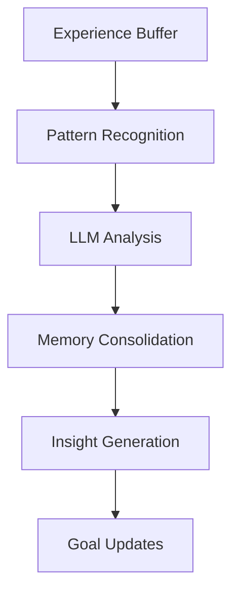

# API Reference: agent-engine

The `agent-engine` library contains the core cognitive systems and simulation orchestration components that bring ARLA agents to life. These classes implement sophisticated behavioral models while remaining world-agnostic through the provider interface system.

!!! info "Cognitive Architecture"
    The agent-engine implements a modular cognitive architecture inspired by theories from psychology and cognitive science, including memory consolidation, emotional appraisal, identity formation, and causal reasoning.

## Core Simulation Engine

The simulation engine orchestrates the entire agent lifecycle, from initialization to shutdown, managing concurrent system execution and state persistence.

### SimulationManager

The primary orchestrator that coordinates all simulation systems and manages the simulation lifecycle.

::: agent_engine.simulation.engine.SimulationManager
    options:
      show_root_heading: true
      show_source: false
      heading_level: 3
      docstring_style: google
      docstring_section_style: table

**Key Responsibilities:**

- **System Registration**: Register and initialize all cognitive and world systems
- **Lifecycle Management**: Handle simulation startup, execution, and shutdown
- **State Coordination**: Manage state persistence and checkpoint creation
- **Error Recovery**: Handle system failures gracefully with rollback capabilities

### SystemManager

Manages the concurrent execution of multiple systems with dependency resolution and performance monitoring.

::: agent_engine.simulation.system.SystemManager
    options:
      show_root_heading: true
      show_source: false
      heading_level: 3
      docstring_style: google
      docstring_section_style: table

**Execution Strategies:**

- **Asynchronous**: Concurrent system execution for maximum performance
- **Serial**: Deterministic execution for debugging and reproducibility
- **Hybrid**: Mixed execution with critical systems running synchronously

---

## Cognitive Systems

These systems implement the core intelligence of ARLA agents, from basic decision-making to complex social reasoning.

### ReflectionSystem

Implements metacognitive capabilities, enabling agents to analyze their experiences and form narrative memories.

::: agent_engine.systems.reflection_system.ReflectionSystem
    options:
      show_root_heading: true
      show_source: false
      heading_level: 3
      docstring_style: google
      docstring_section_style: table

**Reflection Process:**



**Core Functions:**

- **Experience Analysis**: Process recent actions and outcomes for patterns
- **Memory Consolidation**: Convert experiences into lasting narrative memories
- **Insight Generation**: Extract learnings and update agent beliefs
- **Goal Adaptation**: Modify agent objectives based on reflection insights

### QLearningSystem

Implements utility-based decision-making with neural network function approximation and experience replay.

::: agent_engine.systems.q_learning_system.QLearningSystem
    options:
      show_root_heading: true
      show_source: false
      heading_level: 3
      docstring_style: google
      docstring_section_style: table

**Learning Architecture:**

- **State Encoding**: Convert world state to feature vectors via providers
- **Action Valuation**: Estimate expected utility for all available actions
- **Policy Updates**: Update neural network weights based on prediction errors
- **Exploration Strategy**: Balance exploitation with exploration using ε-greedy

**Integration Features:**

- **Causal Rewards**: Incorporates causally-adjusted rewards from CausalGraphSystem
- **Emotional Modulation**: Learning rates affected by emotional state
- **Value Alignment**: Rewards shaped by agent's personal value system

### IdentitySystem

Manages multi-dimensional agent identity across social, competence, moral, relational, and agency domains.

::: agent_engine.systems.identity_system.IdentitySystem
    options:
      show_root_heading: true
      show_source: false
      heading_level: 3
      docstring_style: google
      docstring_section_style: table

**Identity Domains:**

<div class="grid cards" markdown>

-   **Social Identity**

    ---

    Group membership, reputation, and social standing within the community.

-   **Competence Identity**

    ---

    Skills, abilities, and perceived effectiveness in various tasks.

-   **Moral Identity**

    ---

    Ethical principles, values, and moral standing.

-   **Relational Identity**

    ---

    Relationships with other agents and social connections.

-   **Agency Identity**

    ---

    Sense of autonomy, control, and self-efficacy.

</div>

**Identity Dynamics:**

- **Experience Integration**: Update identity based on action outcomes
- **Social Feedback**: Incorporate reactions from other agents
- **Consistency Maintenance**: Resolve conflicts between identity domains
- **Adaptive Flexibility**: Balance stability with growth and change

### GoalSystem

Implements dynamic goal generation, prioritization, and achievement tracking.

::: agent_engine.systems.goal_system.GoalSystem
    options:
      show_root_heading: true
      show_source: false
      heading_level: 3
      docstring_style: google
      docstring_section_style: table

**Goal Lifecycle:**


**Goal Types:**

- **Survival Goals**: Basic needs like health, energy, and safety
- **Social Goals**: Relationship building, reputation, and cooperation
- **Achievement Goals**: Skill development, resource accumulation, and mastery
- **Exploratory Goals**: Curiosity-driven exploration and learning

---

## Advanced Cognitive Features

### Emotional Dynamics

The AffectSystem implements sophisticated emotional modeling based on appraisal theory:

```python
# Example of emotional appraisal calculation
def calculate_emotion(self, event, agent_goals, agent_values):
    """
    Emotion emerges from the intersection of:
    - Goal relevance (does this matter to me?)
    - Outcome controllability (can I influence this?)
    - Value alignment (does this match my values?)
    - Social context (how do others see this?)
    """
    
    appraisal_scores = {
        'goal_relevance': self._assess_goal_relevance(event, agent_goals),
        'controllability': self._assess_controllability(event),
        'value_alignment': self._assess_value_alignment(event, agent_values),
        'social_approval': self._assess_social_context(event)
    }
    
    # Emotions emerge from specific appraisal patterns
    if appraisal_scores['goal_relevance'] > 0.7 and appraisal_scores['controllability'] < 0.3:
        return 'frustration'
    elif appraisal_scores['value_alignment'] > 0.8 and appraisal_scores['social_approval'] > 0.6:
        return 'pride'
    # ... additional emotion patterns
```

### Causal Reasoning

The CausalGraphSystem builds formal causal models using the DoWhy library:

```python
# Example of causal effect estimation
def estimate_action_effect(self, agent_id: str, action: str) -> float:
    """
    Estimate the causal effect of an action using do-calculus.
    
    This answers: "What would happen if the agent were forced
    to take this action, controlling for confounding factors?"
    """
    
    causal_model = self._get_agent_causal_model(agent_id)
    if not causal_model:
        return 0.0  # Fall back to observational data
    
    # Perform causal intervention
    causal_effect = causal_model.estimate_effect(
        treatment_value=action,
        outcome='reward',
        method='iv'  # Instrumental variables
    )
    
    return causal_effect.value
```

### Memory Architecture

Agents maintain multiple memory systems with different retention and access patterns:

```python
class MemoryComponent(Component):
    """Multi-layered memory architecture."""
    
    def __init__(self):
        # Working memory for immediate context
        self.working_memory: List[Experience] = []
        
        # Episodic memory for specific experiences
        self.episodic_memory: List[Episode] = []
        
        # Semantic memory for general knowledge
        self.semantic_memory: Dict[str, ConceptNode] = {}
        
        # Emotional memories with stronger retention
        self.emotional_memories: List[EmotionalEpisode] = []
        
        # Social memories about other agents
        self.social_memory: Dict[str, AgentSchema] = {}
```

---

## System Integration Patterns

### Event-Driven Communication

Systems communicate exclusively through the event bus, enabling loose coupling:

```python
class CognitivePipeline:
    """Example of how cognitive systems coordinate."""
    
    def __init__(self, event_bus):
        self.event_bus = event_bus
        
        # Systems subscribe to relevant events
        self.event_bus.subscribe("action_executed", self.affect_system.process_outcome)
        self.event_bus.subscribe("action_executed", self.q_learning_system.update_policy)
        self.event_bus.subscribe("reflection_completed", self.goal_system.update_goals)
        self.event_bus.subscribe("identity_changed", self.social_system.update_reputation)
    
    async def process_agent_tick(self, agent_id: str, tick: int):
        """Coordinate cognitive processing for one agent."""
        
        # 1. Decision making
        self.event_bus.publish("decision_requested", {
            "agent_id": agent_id,
            "tick": tick
        })
        
        # 2. Action execution happens in world systems
        # 3. Outcome processing happens automatically via subscriptions
        # 4. Reflection triggered periodically
        
        if tick % 50 == 0:  # Reflect every 50 ticks
            self.event_bus.publish("reflection_triggered", {
                "agent_id": agent_id,
                "tick": tick
            })
```

### Provider Integration

Cognitive systems access world data through provider interfaces:

```python
class ReflectionSystem(System):
    """Example of provider usage in cognitive systems."""
    
    def __init__(self, simulation_state, config, cognitive_scaffold):
        super().__init__(simulation_state, config, cognitive_scaffold)
        
        # Providers injected at runtime
        self.vitality_provider = None
        self.narrative_provider = None
        self.state_encoder = None
    
    def set_providers(self, providers: Dict[str, Any]):
        """Dependency injection of world-specific providers."""
        self.vitality_provider = providers.get('vitality')
        self.narrative_provider = providers.get('narrative')
        self.state_encoder = providers.get('state_encoder')
    
    async def generate_reflection(self, agent_id: str) -> str:
        """Generate reflection using injected providers."""
        
        # Get agent components
        components = self.simulation_state.get_entity_components(agent_id)
        
        # Use providers to extract world-specific context
        vitality = self.vitality_provider.get_normalized_vitality_metrics(
            agent_id, components, self.config
        )
        
        narrative_context = self.narrative_provider.get_narrative_context(
            agent_id, components, self.config
        )
        
        # Generate reflection prompt with LLM
        reflection = await self.cognitive_scaffold.generate_reflection(
            vitality_metrics=vitality,
            narrative_context=narrative_context,
            recent_experiences=self._get_recent_experiences(agent_id)
        )
        
        return reflection
```

---

## Performance and Scalability

### Concurrent System Execution

The agent-engine supports multiple execution strategies optimized for different scenarios:

```python
# High-performance async execution
runner = AsyncSystemRunner(systems, event_bus)
await runner.execute_tick(current_tick)

# Deterministic serial execution for debugging
runner = SerialSystemRunner(systems, event_bus)
await runner.execute_tick(current_tick)

# Hybrid execution with system priorities
runner = HybridSystemRunner(systems, event_bus, priorities={
    'ActionSystem': 'sync',      # Critical path
    'ReflectionSystem': 'async', # Can run concurrently
    'LoggingSystem': 'background' # Low priority
})
await runner.execute_tick(current_tick)
```

### Memory and State Management

- **Component Pooling**: Reuse component instances to reduce allocation overhead
- **Lazy Loading**: Load memories and complex state only when needed
- **State Compression**: Compress historical data using efficient encoding
- **Garbage Collection**: Automatically clean up old memories and unused state

### LLM Integration Optimization

```python
class CognitiveScaffold:
    """Optimized LLM integration with caching and batching."""
    
    def __init__(self):
        self.prompt_cache = LRUCache(maxsize=1000)
        self.batch_queue = []
        self.response_futures = {}
    
    async def generate_reflection(self, **context):
        """Generate reflection with caching and batching."""
        
        # Check cache first
        cache_key = self._hash_context(context)
        if cache_key in self.prompt_cache:
            return self.prompt_cache[cache_key]
        
        # Add to batch queue
        request_id = uuid.uuid4()
        self.batch_queue.append({
            'id': request_id,
            'type': 'reflection',
            'context': context
        })
        
        # Process batch when full or after timeout
        if len(self.batch_queue) >= 10:
            await self._process_batch()
        
        # Return future for async completion
        future = asyncio.Future()
        self.response_futures[request_id] = future
        return await future
```

---

## Testing and Debugging

### Cognitive System Testing

```python
import pytest
from unittest.mock import Mock, AsyncMock

class TestReflectionSystem:
    """Example test patterns for cognitive systems."""
    
    @pytest.fixture
    def reflection_system(self):
        mock_state = Mock()
        mock_config = Mock()
        mock_scaffold = AsyncMock()
        
        system = ReflectionSystem(mock_state, mock_config, mock_scaffold)
        
        # Inject mock providers
        system.set_providers({
            'vitality': Mock(),
            'narrative': Mock(),
            'state_encoder': Mock()
        })
        
        return system
    
    async def test_reflection_generation(self, reflection_system):
        """Test reflection generation with mocked dependencies."""
        
        # Setup mock responses
        reflection_system.vitality_provider.get_normalized_vitality_metrics.return_value = {
            'health_norm': 0.8,
            'energy_norm': 0.6
        }
        
        reflection_system.narrative_provider.get_narrative_context.return_value = {
            'recent_events': ['Won a battle', 'Found treasure'],
            'social_context': 'Respected by peers'
        }
        
        # Test reflection generation
        reflection = await reflection_system.generate_reflection("test_agent")
        
        assert reflection is not None
        assert isinstance(reflection, str)
```

### System Integration Testing

```python
async def test_cognitive_pipeline_integration():
    """Test full cognitive pipeline with multiple systems."""
    
    # Setup simulation environment
    manager = SimulationManager(test_config)
    manager.register_system(ActionSystem)
    manager.register_system(ReflectionSystem)
    manager.register_system(GoalSystem)
    manager.register_system(QLearningSystem)
    
    # Create test agent with required components
    agent_id = "test_agent"
    manager.simulation_state.add_component(agent_id, MemoryComponent())
    manager.simulation_state.add_component(agent_id, IdentityComponent())
    manager.simulation_state.add_component(agent_id, GoalComponent())
    
    # Run simulation for several ticks
    for tick in range(10):
        await manager.run_tick(tick)
    
    # Verify cognitive state updates
    memory_comp = manager.simulation_state.get_component(agent_id, MemoryComponent)
    assert len(memory_comp.episodic_memory) > 0
    
    goal_comp = manager.simulation_state.get_component(agent_id, GoalComponent)
    assert len(goal_comp.active_goals) > 0
```

The agent-engine provides a sophisticated yet modular cognitive architecture that can be adapted for a wide range of simulation scenarios while maintaining high performance and extensibility.