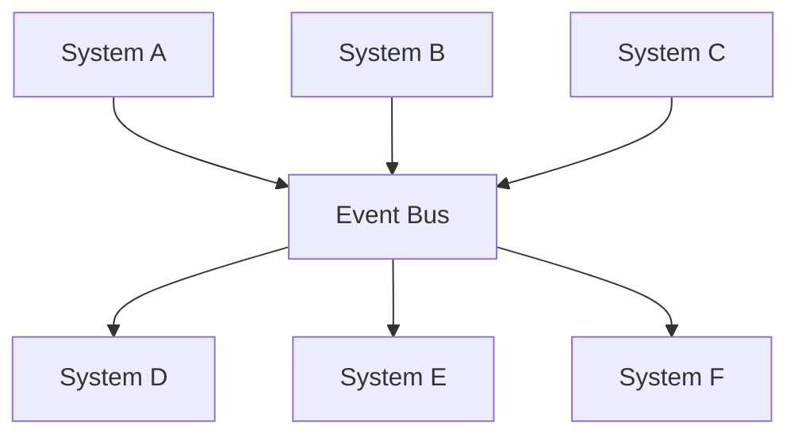
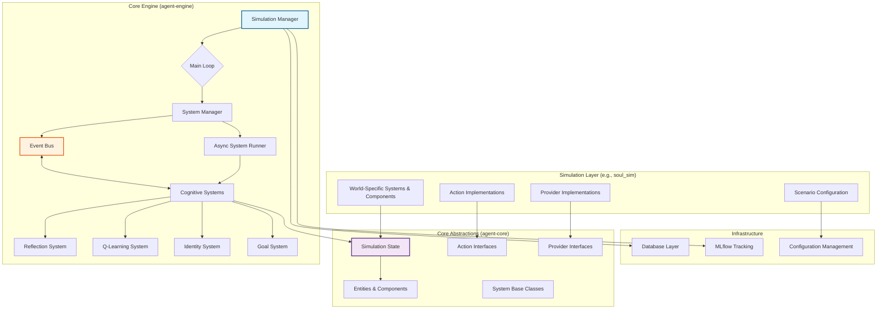
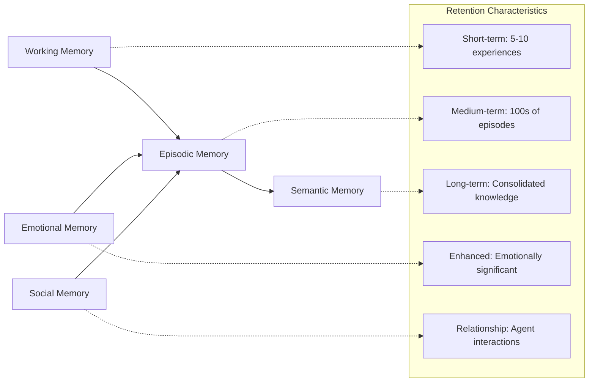
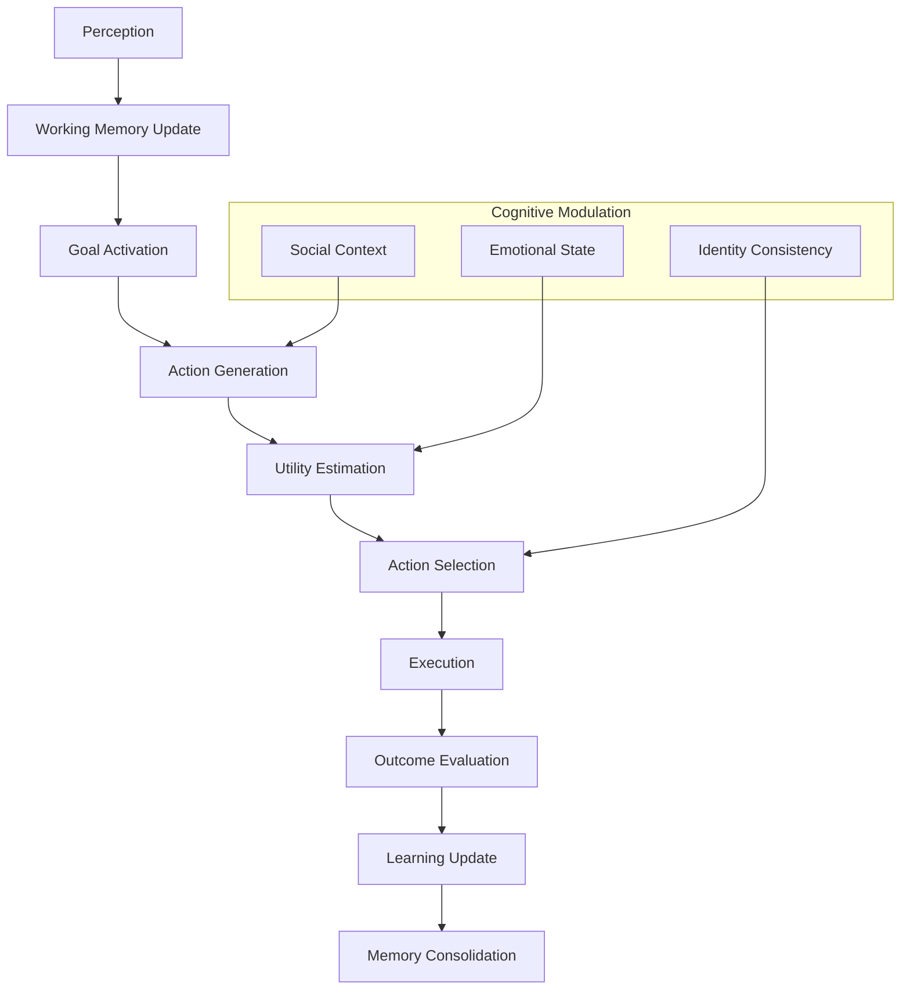
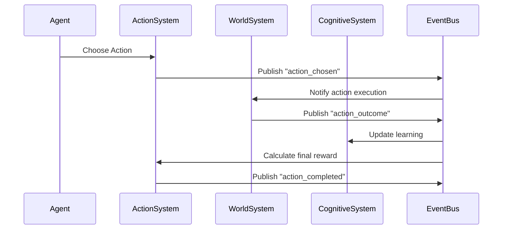

# ARLA Architecture

The ARLA framework is engineered for modularity and extensibility, enabling the construction of sophisticated agent-based simulations with cognitively rich behaviors. At its core, the architecture leverages the Entity Component System (ECS) pattern to enforce strict separation between data and logic, fostering rapid experimentation and research.

!!! info "Design Philosophy"
    ARLA's architecture prioritizes **modularity**, **performance**, and **research reproducibility**. Every design decision supports the ability to isolate, test, and modify individual cognitive components without affecting the broader system.

## Core Architectural Principles

### Data-Oriented Design

At the heart of ARLA is the ECS pattern, which provides clear separation of concerns:

<div class="grid cards" markdown>

-   **Entities**

    ---

    Unique identifiers representing agents or environmental objects. Think of them as database primary keys.

-   **Components**

    ---

    Pure data structures containing an agent's state (memory, health, position). No logic allowed.

-   **Systems**

    ---

    All operational logic that processes entities with specific component combinations.

</div>

This separation makes simulation state transparent, easy to debug, and simple to serialize for analysis.

### Asynchronous Concurrency

All systems are designed to be non-blocking and execute concurrently via an asynchronous scheduler. This architecture is critical for performance, especially when integrating I/O-bound operations like Large Language Model calls.

**Benefits:**

- **Scalability**: Handle thousands of agents with concurrent system execution
- **Responsiveness**: Non-blocking LLM calls don't freeze the simulation
- **Flexibility**: Switch between async and deterministic execution modes

### Decoupled Communication

Systems operate in isolation and communicate indirectly through a central Event Bus. This event-driven approach ensures new functionality can be added without modifying existing systems.



**Event Flow Example:**
* ActionSystem publishes "action_executed" events
* ReflectionSystem, QLearningSystem, and IdentitySystem all subscribe
* Each processes the event independently without knowing about the others

### World-Agnostic Engine

The agent-engine is fundamentally agnostic to the rules of any specific simulation. World-specific logic—such as physics, valid actions, or environmental interactions—is injected through clearly defined provider interfaces.

**Architecture Benefits:**

* **Reusability**: Same cognitive engine works across different simulation worlds
* **Testability**: Mock providers enable isolated testing of cognitive systems
* **Modularity**: Swap world implementations without changing agent logic

---

## High-Level Architecture

The diagram below illustrates the data flow and control between ARLA's primary architectural layers:



**Layer Responsibilities:**

- **Simulation Layer**: World-specific implementations and configurations
- **Core Engine**: Cognitive architecture and simulation orchestration
- **Core Abstractions**: Framework contracts and base implementations
- **Infrastructure**: Data persistence, experiment tracking, and configuration

---

## Cognitive Architecture Components

ARLA implements a comprehensive cognitive architecture inspired by theories from psychology and cognitive science.

### Memory Systems

Agents maintain multiple memory types with different characteristics:



### Decision-Making Pipeline

The cognitive decision-making process follows a sophisticated multi-stage pipeline:



### Emotional Dynamics

Emotions emerge from appraisal patterns based on established psychological theory:

<div class="grid cards" markdown>

-   **Goal Relevance**

    ---

    How much does this event matter to the agent's current objectives?

-   **Controllability**

    ---

    Can the agent influence the outcome of this situation?

-   **Value Alignment**

    ---

    Does this event align with the agent's core values and beliefs?

-   **Social Approval**

    ---

    How do other agents perceive this event and the agent's role in it?

</div>

**Emotion-Cognition Integration:**

- **Attention**: Emotional salience affects what agents notice and remember
- **Learning**: Emotional states modulate learning rates and generalization
- **Decision-Making**: Current mood influences risk-taking and cooperation
- **Memory**: Emotional experiences receive enhanced consolidation

---

## System Integration Patterns

### Provider Pattern Implementation

The provider pattern enables world-agnostic cognitive systems to access world-specific data:

```python
# World-agnostic cognitive system
class ReflectionSystem(System):
    def __init__(self, simulation_state, config, cognitive_scaffold):
        super().__init__(simulation_state, config, cognitive_scaffold)
        self.vitality_provider = None  # Injected at runtime
    
    def reflect_on_experience(self, agent_id: str) -> str:
        # Use provider to get world-specific context
        vitality_data = self.vitality_provider.get_normalized_vitality_metrics(
            agent_id, components, config
        )
        # Generate reflection using world-agnostic logic + world-specific data
        return self._generate_reflection(vitality_data)

# World-specific provider implementation
class FantasyWorldVitalityProvider(VitalityMetricsProviderInterface):
    def get_normalized_vitality_metrics(self, entity_id, components, config):
        health = components.get(HealthComponent)
        mana = components.get(ManaComponent)
        stamina = components.get(StaminaComponent)
        
        return {
            "physical_health": health.current / health.maximum,
            "magical_energy": mana.current / mana.maximum,
            "physical_endurance": stamina.current / stamina.maximum
        }
```

### Event-Driven State Management

All state changes flow through the event bus, creating an auditable trail:



### Concurrent System Execution

Systems execute concurrently while maintaining data consistency:

```python
async def execute_simulation_tick(self, tick: int):
    """Execute one simulation tick with concurrent systems."""
    
    # Phase 1: Perception and decision-making (can run concurrently)
    decision_tasks = [
        self.perception_system.update(tick),
        self.goal_system.update(tick),
        self.decision_system.update(tick)
    ]
    await asyncio.gather(*decision_tasks)
    
    # Phase 2: Action execution (sequential for determinism)
    await self.action_system.update(tick)
    
    # Phase 3: World updates (can run concurrently)
    world_tasks = [
        self.movement_system.update(tick),
        self.combat_system.update(tick),
        self.environment_system.update(tick)
    ]
    await asyncio.gather(*world_tasks)
    
    # Phase 4: Learning and reflection (can run concurrently)
    learning_tasks = [
        self.q_learning_system.update(tick),
        self.reflection_system.update(tick),
        self.identity_system.update(tick)
    ]
    await asyncio.gather(*learning_tasks)
```

---

## Performance Considerations

### Scalability Architecture

ARLA is designed to scale from single-agent studies to large population simulations:

**Agent Scaling:**
- **1-100 agents**: Single-threaded execution with full cognitive features
- **100-1,000 agents**: Concurrent system execution with selective cognitive features
- **1,000+ agents**: Distributed execution with cognitive feature batching

**Memory Management:**
- Component pooling to reduce allocation overhead
- Lazy loading of memory and historical data
- Automatic garbage collection of old experiences

### LLM Integration Optimization

Large Language Model calls are the primary performance bottleneck, addressed through:

**Caching Strategies:**
- Prompt caching for repeated reflection patterns
- Response caching for similar contexts
- Semantic similarity matching for near-duplicates

**Batching Mechanisms:**
- Batch multiple agent reflections into single API calls
- Priority queuing for time-sensitive operations
- Background processing for non-critical reflections

**Cost Management:**
- Token usage monitoring and budget enforcement
- Adaptive reflection frequency based on available budget
- Fallback to rule-based reasoning when LLM unavailable

---

## Research Applications

### Ablation Studies

ARLA's modular architecture enables precise ablation studies:

```python
# Study the effect of identity on cooperation
configs = [
    {"systems": ["ActionSystem", "QLearningSystem", "IdentitySystem"]},
    {"systems": ["ActionSystem", "QLearningSystem"]},  # No identity
]

# Study the effect of emotion on decision-making
configs = [
    {"affect_system": {"enabled": True}},
    {"affect_system": {"enabled": False}},  # No emotions
]

# Study the effect of causal reasoning on learning
configs = [
    {"q_learning": {"use_causal_rewards": True}},
    {"q_learning": {"use_causal_rewards": False}},  # Raw rewards only
]
```

### Emergent Behavior Studies

The architecture supports studying emergence at multiple levels:

- **Individual**: How do cognitive components interact to produce behavior?
- **Dyadic**: How do pairs of agents develop relationships and cooperation?
- **Group**: How do social norms and hierarchies emerge in populations?
- **Population**: How do cultural patterns and institutions develop over time?

### Reproducibility Features

Research reproducibility is built into the architecture:

- **Deterministic Execution**: Exact reproduction with identical random seeds
- **Configuration Versioning**: Git-tracked configuration with validation
- **State Snapshots**: Complete simulation state capture at any point
- **Experiment Tracking**: Automatic logging of hyperparameters and results

---

## Extension Points

### Adding New Cognitive Systems

Create custom cognitive capabilities by extending the System base class:

```python
class CreativitySystem(System):
    """Custom system for modeling creative problem-solving."""
    
    def __init__(self, simulation_state, config, cognitive_scaffold):
        super().__init__(simulation_state, config, cognitive_scaffold)
        
        if self.event_bus:
            self.event_bus.subscribe("problem_encountered", self.generate_creative_solution)
    
    async def generate_creative_solution(self, event_data):
        # Custom creative reasoning logic
        pass
```

### Creating New Provider Interfaces

Define domain-specific data access patterns:

```python
class CreativityContextProviderInterface(ABC):
    """Interface for providing creativity-relevant context."""
    
    @abstractmethod
    def get_creative_resources(self, entity_id: str, components: Dict, config: Dict) -> Dict[str, Any]:
        """Return available creative resources and constraints."""
        pass
    
    @abstractmethod
    def get_inspiration_sources(self, entity_id: str, components: Dict, config: Dict) -> List[str]:
        """Return potential sources of creative inspiration."""
        pass
```

### World Integration

Integrate ARLA with existing simulation environments:

```python
class ExternalWorldAdapter:
    """Adapter pattern for integrating external simulation engines."""
    
    def __init__(self, external_sim, arla_simulation_state):
        self.external_sim = external_sim
        self.arla_state = arla_simulation_state
    
    async def sync_states(self):
        """Synchronize state between ARLA and external simulation."""
        
        # Extract state from external simulation
        external_entities = self.external_sim.get_all_entities()
        
        # Update ARLA components
        for entity_id, external_state in external_entities.items():
            self._update_arla_components(entity_id, external_state)
    
    def _update_arla_components(self, entity_id: str, external_state: dict):
        """Convert external state to ARLA components."""
        
        # Convert position
        if "position" in external_state:
            pos_comp = PositionComponent(
                x=external_state["position"]["x"],
                y=external_state["position"]["y"]
            )
            self.arla_state.add_component(entity_id, pos_comp)
        
        # Convert health
        if "health" in external_state:
            health_comp = HealthComponent(
                current_health=external_state["health"]["current"],
                max_health=external_state["health"]["maximum"]
            )
            self.arla_state.add_component(entity_id, health_comp)
```

ARLA's architecture provides a robust foundation for agent-based modeling research while maintaining the flexibility needed for diverse simulation scenarios and experimental designs.