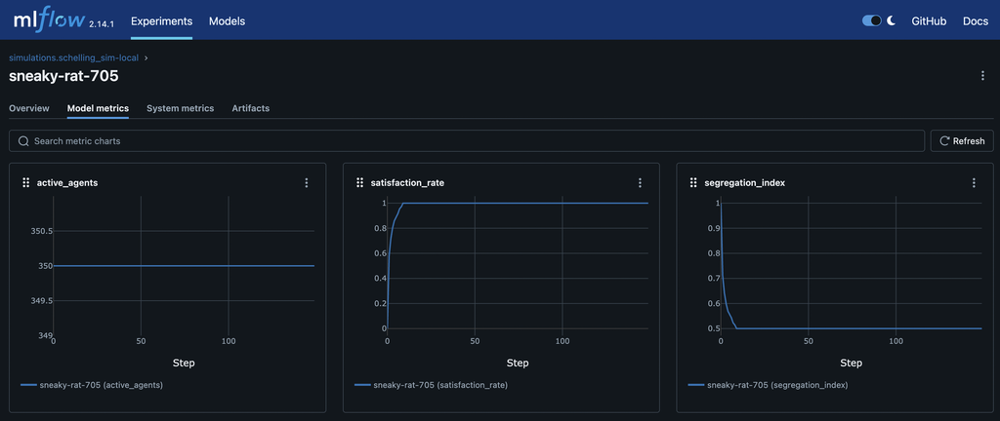

# From Schelling to Psyche: A Technical Look at Validating ARLA

{: .blog-hero }

Welcome back to the ARLA Development Blog! In our first post, we introduced our vision for a modular framework for building cognitively rich agents. Today, we're diving into the code to show how we're building and validating this platform, starting with a classic: the [Schelling Segregation Model](https://en.wikipedia.org/wiki/Schelling%27s_model_of_segregation).

This isn't just an academic exercise. It's a critical, two-phase process to build a robust foundation for groundbreaking research. First, we implement a simple version to serve as a "smoke test." In later posts, we will use that stable baseline to conduct sophisticated ablative studies on complex cognitive features.

## Phase 1: The Baseline - A Rule-Based Schelling Model

Before we can trust our advanced cognitive systems, we must verify that the basic mechanics of the engine—state management, action execution, and system updates—are working correctly. The Schelling model is perfect for this because its outcome is well-understood.

Our baseline implementation is purely rule-based and relies on three key world-specific components.

**PositionComponent**: Stores the agent's `(x, y)` coordinates.

**GroupComponent**: Assigns the agent's type (e.g., group `1` or `2`).

**SatisfactionComponent**: A simple data container that holds the agent's satisfaction threshold and its current state.

```python title="simulations/schelling_sim/components.py"

class SatisfactionComponent(Component):
    """Stores an agent's satisfaction state and threshold."""

    def __init__(self, satisfaction_threshold: float) -> None:
        self.satisfaction_threshold = satisfaction_threshold
        self.is_satisfied: bool = False

    # ... to_dict() and validate() methods ...
```

With these components in place, the logic is driven by two simple, world-specific systems:

**SatisfactionSystem**: On every tick, this system iterates through all agents. It checks an agent's neighbors and updates the `is_satisfied` flag in its SatisfactionComponent based on whether the ratio of same-type neighbors meets its threshold.

```python title="simulations/schelling_sim/systems.py"

# Inside SatisfactionSystem.update()
for _, components in all_agents.items():
    # ... get components ...
    neighbors = env.get_neighbors_of_position(pos_comp.position)
    if len(neighbors) == 0:
        satisfaction_comp.is_satisfied = True
        continue

    same_type_neighbors = 0
    for neighbor_id in neighbors.values():
        # ... count same-type neighbors ...

    satisfaction_ratio = same_type_neighbors / len(neighbors)
    satisfaction_comp.is_satisfied = satisfaction_ratio >= satisfaction_comp.satisfaction_threshold
```

**MovementSystem**: This system subscribes to the `execute_move_to_empty_cell_action` event. When triggered, it handles the logic of updating the agent's `PositionComponent` and moving the agent within the `SchellingGridEnvironment`.

This setup establishes our control group. The behavior is simple, deterministic, and verifiable.

And as expected, we see that the agents start with a low `satisfaction_rate` and explore until they meet an equilibrium at around 100% satisfaction. We also see the segregation_index starting near `1.0`—a randomly mixed population—and dropping to around `0.5` as the agents move and the population becomes more segregated.



## Phase 2: The Frontier of Cognitive Ablation

With a validated baseline, we can now use the Schelling model as a laboratory for cognitive science. ARLA's architecture allows us to layer on advanced, world-agnostic cognitive systems from agent-engine and precisely measure their effects. This is the core of ablative analysis.

### Experiment 1: Adding Subjective Rewards

Instead of a fixed reward for moving, what if the reward was subjective, influenced by the agent's emotional state? We can test this by enabling the AffectSystem and modifying our world's RewardCalculator.

The `ActionSystem` uses a dependency-injected `RewardCalculator` to determine the final reward for any action. We can create a custom calculator that accesses the agent's `EmotionComponent` and modifies the reward based on its emotional valence.

```python
# A hypothetical RewardCalculator for an advanced study

class EmotionModulatedRewardCalculator(RewardCalculatorInterface):
    def calculate_final_reward(self, base_reward, ..., entity_components):
        emotion_comp = entity_components.get(EmotionComponent)
        
        # If the agent is feeling positive (high valence), it gets a bigger reward
        # for taking an action that aligns with its goals.
        if emotion_comp and emotion_comp.valence > 0.5:
            final_reward = base_reward * (1 + emotion_comp.valence)
        else:
            final_reward = base_reward
            
        # ... return final_reward and breakdown ...
```

By running the simulation with and without this emotional modulation, we can quantitatively measure how an agent's internal affective state influences the emergent segregation pattern.

### Experiment 2: Causal Reasoning vs. Simple Rules

In the baseline model, agents are unhappy simply because of the ratio of their neighbors. But what if the true cause of unhappiness in a dense simulation is the lack of open space?

By enabling the `CausalGraphSystem`, agents can build a formal causal model from their experiences. The `QLearningSystem` can then use this model to get a more robust learning signal that moves beyond simple correlation.

```python
# In the QLearningSystem...

# Instead of just using the observed reward from the environment...
final_learning_reward = action_outcome.reward

# The system can query the agent's own causal model to find the "true" effect
# of its action, controlling for confounding factors.
causal_reward_estimate = self.causal_graph_system.estimate_causal_effect(
    agent_id=entity_id, treatment_value=action_plan.action_type.action_id
)

# It then blends the two to create a more robust learning signal
if causal_reward_estimate is not None:
    final_learning_reward = 0.5 * action_outcome.reward + 0.5 * causal_reward_estimate
```

This allows us to test a fascinating hypothesis: Can agents with a causal reasoning module learn to overcome their innate biases and discover a more optimal, less-segregated settlement pattern?

## Your Turn to Experiment

This two-phase approach—validate with classics, then innovate with cognitive layers—is central to ARLA's design. The Schelling simulation, now part of the codebase, is the first of many such testbeds.

We encourage you to dive into the code yourself. The full implementation can be found in the `simulations/schelling_sim/` directory. Clone the repository, run the experiment, and start tinkering. What happens if you change the satisfaction threshold? What other cognitive systems could influence this classic model?

This is just the beginning, and we can't wait to see what you build.