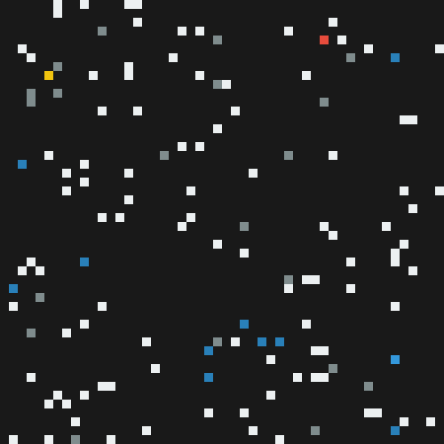
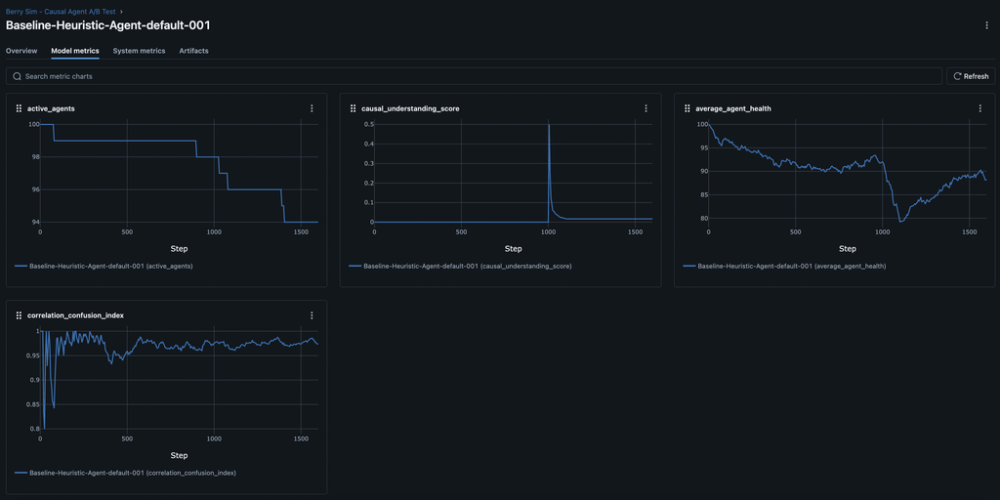
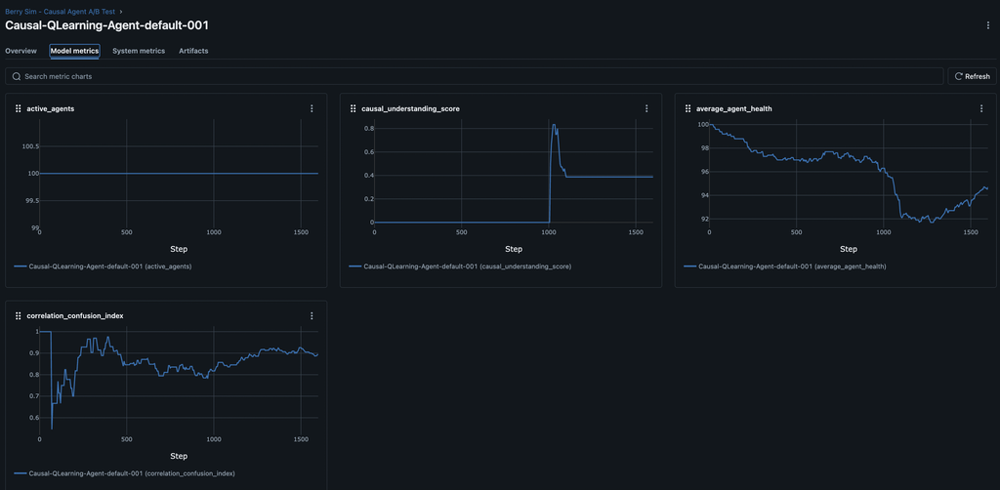

# Can AI Tell "Why?": Probing Causal Reasoning in ARLA



Welcome back to the ARLA Development Blog! [In our last post](https://renbytes.github.io/arla/blog/2025/08/21/from-schelling-to-psyche-a-technical-look-at-validating-arla/), we used the classic Schelling Model as a "smoke test" to validate our engine's core mechanics. With that foundation in place, we can now ask deeper questions. Can we build agents that move beyond simple pattern matching to understand true cause and effect?

To find out, we designed the Berry Toxicity Experiment. The intuition is simple. Imagine you're playing a video game and you learn that blue potions give you health. You'd drink every one you see. But what if the game suddenly changes the rules halfway through? Now, blue potions are poisonous, but only when you're standing near water. A simple bot might keep drinking them and fail, but a truly intelligent player would notice the new pattern and figure out the new, more complex rule. That's exactly what we're testing here: can our AI agents be the smart player?

This is a challenging A/B test where survival depends on an agent's ability to learn these complex, contextual rules and adapt to a sudden environmental change.

## Phase 1: The Baseline - A "Blind" Heuristic Forager

Our control group is the Baseline-Heuristic-Agent. Its strategy is simple and hardcoded: find the closest visible berry and move towards it. However, the environment has a trick up its sleeve:

**The Test:** At step 1000, blue berries, which were previously safe, become toxic—but only when they are near water.

The baseline agent's logic is straightforward, relying on direct access to the environment's state to find its target.

```python
class BerryDecisionSelector(DecisionSelectorInterface):
    """A simple heuristic policy for the baseline agent."""
    def select(self, sim_state, entity_id, possible_actions):
        # ...
        # This agent has "perfect vision" into the environment
        for berry_pos in env.berry_locations.keys():
            # Find the closest berry and move towards it
            # ...
```

As expected, this simple agent performs well until the rules change. The MLflow results for the baseline agent show a predictable and catastrophic failure to adapt.

At step 1000, the `average_agent_health` plummets, leading to a sharp drop in `active_agents`. The `causal_understanding_score` flatlines near zero, proving the agent failed to learn the new rule.



## Phase 2: The Causal Agent - Learning to See

Our experimental group is the Causal-QLearning-Agent. It uses a sophisticated Q-learning model to make decisions. Crucially, we gave this agent "senses" by equipping it with a `PerceptionComponent` and a more advanced state encoder.

Instead of being blind, its "brain" now receives a rich feature vector describing its surroundings.

```python
class BerryStateEncoder(StateEncoderInterface):
    def encode_state(self, sim_state, entity_id, config):
        """
        Creates a feature vector including agent vitals and sensory data.
        """
        # ... (agent's own x, y, and health)
        agent_state_vector = [agent_x, agent_y, health]

        # NEW: Sensory data about the nearest visible berries
        perception_vector = []
        for berry_type in ["red", "blue", "yellow"]:
            # ... find nearest berry of this type ...
            if berry_data:
                # Add normalized distance and angle to the feature vector
                dist = berry_data["distance"] / vision_range
                angle = math.atan2(dy, dx) / math.pi
                perception_vector.extend([dist, angle])
            else:
                # Use default values if no berry is seen
                perception_vector.extend([1.0, 0.0])

        return np.array(agent_state_vector + perception_vector)
```

At step 1000, the `average_agent_health` falls then recovers and is not enough to kill off as many agents `active_agents`. The `causal_understanding_score` spikes then remains higher-roughly 2X higher than our baseline agents-proving the agent failed to learn the new rule.



## The A/B Test: A Clear Winner

The results are conclusive.

```
--- A/B Test Statistical Analysis ---

📋 Group Averages (Final Health):
  - Causal Agent: 95.82
  - Baseline Agent: 90.25

🔬 T-Test Results:
  - T-Statistic: 3.1675
  - P-Value: 0.0344

💡 Conclusion:
  The p-value (0.0344) is less than our significance level (0.05).
  ✅ We can conclude that there is a **statistically significant** difference
     in the average final health between the two agent types.
```

This isn't just a fluke; the data proves that the Causal Agent's ability to learn and adapt provides a real, measurable survival advantage. The visual evidence from the MLflow graphs supports this statistical conclusion perfectly.

**Successful Adaptation:** The `causal_understanding_score` for the Causal Agent spikes to nearly 1.0, proving it successfully learned the new, complex rule about blue berries and water.

**Damage Mitigation:** The `average_agent_health` shows only a minor dip before recovering, as the agent quickly stops eating the toxic berries.

**Dramatically Higher Survival:** Most importantly, the `active_agents` graph shows minimal or zero population loss. The Causal Agent learned to survive where the baseline agent perished.

## Your Turn to Experiment

This experiment highlights a core principle of AI: a sophisticated brain is useless without the right sensory information. By engineering a better state representation, we enabled our learning agent to understand its world and thrive.

The full implementation is available in the simulations/berry_sim/ directory. We encourage you to run the experiment yourself and try to improve on our results. Can you design an even better state representation? What other cognitive systems could help the agent learn faster or more reliably?

```bash
# Run the full A/B test yourself!
make run FILE=simulations/berry_sim/experiments/causal_ab_test.yml WORKERS=8
```

You can check the ongoing metrics at [http://localhost:5001/](http://localhost:5001/)

And when the simulation is complete, you can run the A/B test like so:
```bash
docker compose exec app poetry run python simulations/berry_sim/analysis/analyze_ab_test.py
```

This successful validation opens the door to even more complex research. Now that we have agents who can understand their world, our next post will explore whether they can learn to communicate with each other about it.
