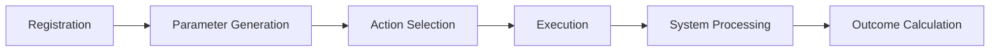

# Creating Custom Actions

Actions are the building blocks of agent behavior in ARLA. They define what agents can do, from basic movement to complex social interactions. This guide walks through creating robust, extensible actions.

!!! info "Action Design Philosophy"
    Actions should define **what is possible**, not **how it's implemented**. The actual state changes happen in Systems via the event bus, keeping actions lightweight and testable.

## Action Architecture

### The ActionInterface Contract

Every action must implement the `ActionInterface`, ensuring consistent integration with the simulation engine:

```python
class ActionInterface:
    @property
    def action_id(self) -> str: ...        # Unique identifier
    @property 
    def name(self) -> str: ...             # Human-readable name
    
    def get_base_cost(self, simulation_state) -> float: ...
    def generate_possible_params(self, entity_id, simulation_state, current_tick) -> List[Dict]: ...
    def execute(self, entity_id, simulation_state, params, current_tick) -> ActionOutcome: ...
    def get_feature_vector(self, entity_id, simulation_state, params) -> List[float]: ...
```

### Action Lifecycle



1. **Registration**: `@action_registry.register` makes action discoverable
2. **Parameter Generation**: Creates valid action variants for current world state
3. **Selection**: AI/heuristic systems choose from available actions
4. **Execution**: Returns ActionOutcome, publishes event for Systems
5. **System Processing**: World-specific logic updates simulation state
6. **Outcome Calculation**: Final rewards and consequences computed

---

## Example: Communication Action

Let's build a comprehensive communication system that demonstrates best practices:

=== "Basic Structure"

    ```python title="actions/communicate_action.py"
    from typing import Any, Dict, List, Optional
    from dataclasses import dataclass
    
    from agent_core.agents.actions.action_interface import ActionInterface
    from agent_core.agents.actions.action_registry import action_registry
    from agent_core.agents.actions.base_action import ActionOutcome
    from agent_core.core.ecs.abstractions import SimulationState
    
    @dataclass
    class CommunicationParams:
        """Structured parameters for communication actions."""
        target_agent_id: str
        message_type: str  # "greeting", "trade_offer", "warning", etc.
        message_content: str
        urgency: float = 0.5  # 0.0 = casual, 1.0 = urgent
        requires_response: bool = False
    
    @action_registry.register
    class CommunicateAction(ActionInterface):
        """Enables agents to send messages to nearby agents."""
        
        # Action costs by message type
        MESSAGE_COSTS = {
            "greeting": 0.5,
            "trade_offer": 1.0,
            "warning": 0.3,
            "insult": 0.2,
            "compliment": 0.4
        }
        
        @property
        def action_id(self) -> str:
            return "communicate"
        
        @property
        def name(self) -> str:
            return "Communicate"
    ```

=== "Parameter Generation"

    ```python
    def generate_possible_params(
        self, 
        entity_id: str, 
        simulation_state: SimulationState, 
        current_tick: int
    ) -> List[Dict[str, Any]]:
        """Generate communication possibilities based on context."""
        
        # Get agent's position and social memory
        pos_comp = simulation_state.get_component(entity_id, "PositionComponent")
        social_comp = simulation_state.get_component(entity_id, "SocialMemoryComponent")
        
        if not pos_comp:
            return []
        
        possible_actions = []
        
        # Find nearby agents
        nearby_agents = self._find_nearby_agents(
            simulation_state, 
            pos_comp, 
            max_distance=5
        )
        
        for target_id, distance in nearby_agents:
            if target_id == entity_id:
                continue
                
            # Generate context-appropriate messages
            relationship = self._get_relationship_context(
                social_comp, target_id
            )
            
            message_options = self._generate_message_options(
                relationship, distance, current_tick
            )
            
            for msg_type, content in message_options:
                params = CommunicationParams(
                    target_agent_id=target_id,
                    message_type=msg_type,
                    message_content=content,
                    urgency=self._calculate_urgency(relationship, msg_type),
                    requires_response=msg_type in ["trade_offer", "question"]
                )
                
                possible_actions.append(params.__dict__)
        
        return possible_actions
    
    def _find_nearby_agents(
        self, 
        simulation_state: SimulationState, 
        pos_comp, 
        max_distance: int
    ) -> List[tuple[str, int]]:
        """Find agents within communication range."""
        nearby = []
        my_pos = (pos_comp.x, pos_comp.y)
        
        # Query all entities with position components
        for entity_id, components in simulation_state.get_entities_with_components([
            "PositionComponent"
        ]).items():
            other_pos_comp = components["PositionComponent"]
            other_pos = (other_pos_comp.x, other_pos_comp.y)
            
            # Calculate Manhattan distance
            distance = abs(my_pos[0] - other_pos[0]) + abs(my_pos[1] - other_pos[1])
            
            if distance <= max_distance:
                nearby.append((entity_id, distance))
        
        return nearby
    
    def _generate_message_options(
        self, 
        relationship: Dict[str, Any], 
        distance: int, 
        current_tick: int
    ) -> List[tuple[str, str]]:
        """Generate appropriate messages based on context."""
        options = []
        
        # Always available: basic greeting
        options.append(("greeting", "Hello there!"))
        
        # Relationship-based messages
        if relationship.get("trust", 0.5) > 0.7:
            options.append(("compliment", "You're doing great work!"))
            options.append(("trade_offer", "Want to trade resources?"))
        
        if relationship.get("threat_level", 0.0) > 0.5:
            options.append(("warning", "Stay back!"))
        
        # Distance-based messages
        if distance == 1:  # Adjacent
            options.append(("whisper", "Psst, over here..."))
        
        return options
    ```

=== "Execution & Features"

    ```python
    def execute(
        self,
        entity_id: str,
        simulation_state: SimulationState,
        params: Dict[str, Any],
        current_tick: int,
    ) -> ActionOutcome:
        """Execute communication action."""
        target_id = params.get("target_agent_id")
        message_type = params.get("message_type", "greeting")
        content = params.get("message_content", "")
        
        # Validate target exists and is in range
        if not self._validate_target(simulation_state, entity_id, target_id):
            return ActionOutcome(
                success=False,
                message=f"Cannot communicate with {target_id}: out of range or invalid",
                base_reward=-0.1
            )
        
        # Calculate success probability based on relationship
        success_prob = self._calculate_success_probability(
            simulation_state, entity_id, target_id, message_type
        )
        
        import random
        success = random.random() < success_prob
        
        outcome_message = (
            f"Agent {entity_id} {message_type}s to {target_id}: '{content}'"
            if success else 
            f"Agent {entity_id}'s {message_type} to {target_id} was ignored"
        )
        
        return ActionOutcome(
            success=success,
            message=outcome_message,
            base_reward=0.2 if success else -0.05
        )
    
    def get_base_cost(self, simulation_state: SimulationState) -> float:
        """Dynamic cost based on recent communication frequency."""
        # Could implement fatigue system here
        return 1.0
    
    def get_feature_vector(
        self,
        entity_id: str,
        simulation_state: SimulationState,
        params: Dict[str, Any],
    ) -> List[float]:
        """Encode action for machine learning."""
        
        # One-hot encode message types
        message_types = ["greeting", "trade_offer", "warning", "insult", "compliment"]
        message_type = params.get("message_type", "greeting")
        
        type_encoding = [1.0 if msg_type == message_type else 0.0 
                        for msg_type in message_types]
        
        # Additional features
        features = type_encoding + [
            float(params.get("urgency", 0.5)),           # Urgency level
            1.0 if params.get("requires_response") else 0.0,  # Expects response
            self._get_relationship_strength(simulation_state, entity_id, 
                                          params.get("target_agent_id", ""))
        ]
        
        return features
    
    def _get_relationship_strength(
        self, 
        simulation_state: SimulationState, 
        entity_id: str, 
        target_id: str
    ) -> float:
        """Get normalized relationship strength."""
        social_comp = simulation_state.get_component(entity_id, "SocialMemoryComponent")
        if not social_comp or target_id not in social_comp.relationships:
            return 0.5  # Neutral
        
        relationship = social_comp.relationships[target_id]
        return relationship.get("trust", 0.5)
    ```

---

## Advanced Action Patterns

### Multi-Step Actions

For actions that span multiple ticks:

```python
@action_registry.register
class BuildAction(ActionInterface):
    """Action that takes multiple ticks to complete."""
    
    def generate_possible_params(self, entity_id, simulation_state, current_tick):
        # Check if agent is already building
        build_comp = simulation_state.get_component(entity_id, "BuildingComponent")
        if build_comp and build_comp.is_building:
            return [{"action": "continue_building"}]
        
        # Generate new building options
        return [
            {"action": "start_building", "structure_type": "shelter"},
            {"action": "start_building", "structure_type": "workshop"}
        ]
```

### Conditional Actions

Actions available only under specific conditions:

```python
@action_registry.register
class TradeAction(ActionInterface):
    """Trading requires specific inventory items."""
    
    def generate_possible_params(self, entity_id, simulation_state, current_tick):
        inventory = simulation_state.get_component(entity_id, "InventoryComponent")
        if not inventory or len(inventory.items) == 0:
            return []  # No items to trade
        
        # Find potential trading partners
        nearby_traders = self._find_traders_with_desired_items(
            simulation_state, entity_id, inventory.wishlist
        )
        
        if not nearby_traders:
            return []
        
        # Generate trade offers
        return self._generate_trade_offers(inventory, nearby_traders)
```

### Composite Actions

Actions that trigger multiple sub-actions:

```python
@action_registry.register  
class AttackAction(ActionInterface):
    """Combat action with movement and damage components."""
    
    def execute(self, entity_id, simulation_state, params, current_tick):
        # This will trigger multiple systems:
        # 1. MovementSystem (if need to close distance)
        # 2. CombatSystem (for damage calculation)
        # 3. SocialSystem (for reputation effects)
        
        return ActionOutcome(
            success=True,
            message=f"Agent {entity_id} attacks {params['target']}",
            base_reward=0.0,  # Determined by combat outcome
            metadata={
                "triggers_movement": params.get("requires_movement", False),
                "combat_type": params.get("weapon_type", "melee")
            }
        )
```

---

## Testing Actions

### Unit Testing Pattern

```python
import pytest
from unittest.mock import Mock, MagicMock

class TestCommunicateAction:
    def setup_method(self):
        self.action = CommunicateAction()
        self.mock_simulation_state = Mock()
        
    def test_generate_params_no_nearby_agents(self):
        """Test parameter generation with no nearby agents."""
        # Mock empty position component
        self.mock_simulation_state.get_component.return_value = None
        
        params = self.action.generate_possible_params(
            "agent_001", self.mock_simulation_state, 100
        )
        
        assert params == []
    
    def test_execute_valid_communication(self):
        """Test successful communication execution."""
        params = {
            "target_agent_id": "agent_002",
            "message_type": "greeting",
            "message_content": "Hello!"
        }
        
        outcome = self.action.execute(
            "agent_001", self.mock_simulation_state, params, 100
        )
        
        assert outcome.success
        assert "greeting" in outcome.message
        assert outcome.base_reward > 0
```

### Integration Testing

```python
async def test_communication_system_integration():
    """Test full communication flow with actual systems."""
    
    # Set up simulation with communication system
    manager = SimulationManager(test_config)
    manager.register_system(CommunicationSystem)
    
    # Create test agents
    agent1 = manager.create_agent("test_agent_1")
    agent2 = manager.create_agent("test_agent_2")
    
    # Place agents near each other
    pos1 = PositionComponent(x=5, y=5)
    pos2 = PositionComponent(x=6, y=5)
    
    manager.simulation_state.add_component(agent1, pos1)
    manager.simulation_state.add_component(agent2, pos2)
    
    # Force communication action
    action = CommunicateAction()
    params = action.generate_possible_params(agent1, manager.simulation_state, 1)
    
    assert len(params) > 0
    
    # Execute and verify system processes it
    outcome = action.execute(agent1, manager.simulation_state, params[0], 1)
    assert outcome.success
```

---

## Performance Optimization

### Efficient Parameter Generation

```python
def generate_possible_params(self, entity_id, simulation_state, current_tick):
    # Cache expensive calculations
    if not hasattr(self, '_nearby_cache') or current_tick % 10 == 0:
        self._nearby_cache = self._build_proximity_cache(simulation_state)
    
    # Use cached data for parameter generation
    nearby_agents = self._nearby_cache.get(entity_id, [])
    return self._generate_params_from_cache(entity_id, nearby_agents)
```

### Memory-Efficient Features

```python
def get_feature_vector(self, entity_id, simulation_state, params):
    # Use numpy for efficient numeric operations
    import numpy as np
    
    features = np.zeros(self.FEATURE_VECTOR_SIZE, dtype=np.float32)
    
    # Sparse encoding for categorical features
    message_type_idx = self.MESSAGE_TYPE_TO_INDEX.get(
        params.get("message_type"), 0
    )
    features[message_type_idx] = 1.0
    
    return features.tolist()
```

---

## Common Pitfalls

### Avoid Heavy Logic in Actions

**Wrong:**
```python
def execute(self, entity_id, simulation_state, params, current_tick):
    # Don't do complex state modifications here!
    target_health = simulation_state.get_component(params["target"], "HealthComponent")
    target_health.current_health -= params["damage"]  # BAD!
    
    return ActionOutcome(success=True, message="Attack executed")
```

**Right:**
```python
def execute(self, entity_id, simulation_state, params, current_tick):
    # Just return the outcome - let CombatSystem handle the logic
    return ActionOutcome(
        success=True,
        message=f"Agent {entity_id} attacks {params['target']}",
        base_reward=0.1
    )
```

### Parameter Validation

```python
def execute(self, entity_id, simulation_state, params, current_tick):
    # Always validate parameters
    required_params = ["target_agent_id", "message_type"]
    for param in required_params:
        if param not in params:
            return ActionOutcome(
                success=False,
                message=f"Missing required parameter: {param}",
                base_reward=-0.1
            )
    
    # Rest of execution logic...
```

### Feature Vector Consistency

```python
class CommunicateAction(ActionInterface):
    # Define feature vector size as class constant
    FEATURE_VECTOR_SIZE = 10
    
    def get_feature_vector(self, entity_id, simulation_state, params):
        features = [0.0] * self.FEATURE_VECTOR_SIZE
        # Always return exactly FEATURE_VECTOR_SIZE elements
        return features
```

Actions form the interface between agent decision-making and world simulation. By following these patterns, you'll create robust, testable actions that integrate seamlessly with ARLA's cognitive architecture.