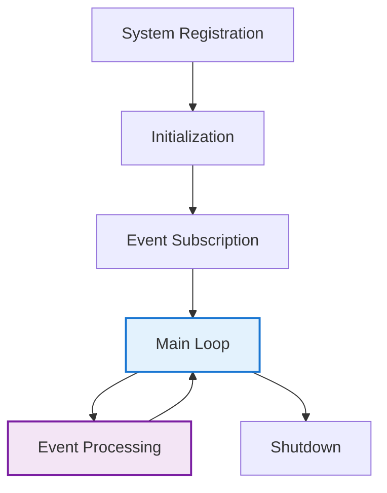

# Creating New Systems

Systems are the engines of logic in ARLA's ECS architecture. While Actions define what agents can do, Systems define how those actions (and other simulation rules) affect the world. This guide demonstrates building a complete communication system that showcases advanced patterns and best practices.

!!! info "System Design Philosophy"
    Systems should contain **logic, not data**. They operate on entities with specific component combinations and communicate through events, not direct calls. This separation enables modularity, testability, and concurrent execution.

## System Architecture Overview

### The Role of Systems

Systems in ARLA follow a specific pattern designed for scalability and maintainability:

<div class="grid cards" markdown>

-   **Single Responsibility**

    ---

    Each system handles one specific domain (movement, combat, communication, etc.)

-   **Event-Driven**

    ---

    Systems communicate through the event bus, never direct method calls

-   **Stateless**

    ---

    Systems contain minimal local state, reading from and writing to Components

-   **Concurrent**

    ---

    Systems can execute concurrently via async/await patterns

</div>

### System Lifecycle



---

## Example: Communication System

Let's build a comprehensive communication system that handles agent-to-agent messaging, relationship updates, and social dynamics.

### Step 1: Define Supporting Components

First, create the components that store communication-related data:

=== "Social Components"

    ```python title="components/social_components.py"
    from typing import Dict, List, Optional, Any
    from dataclasses import dataclass
    from agent_core.core.ecs.component import Component

    @dataclass
    class Message:
        """Represents a single communication event."""
        sender_id: str
        content: str
        message_type: str  # "greeting", "trade_offer", "warning", etc.
        timestamp: int
        urgency: float = 0.5
        requires_response: bool = False

    class CommunicationComponent(Component):
        """Stores agent's communication abilities and message queue."""
        
        def __init__(self, max_range: int = 5, language_skill: float = 1.0):
            self.max_range = max_range
            self.language_skill = language_skill
            self.message_queue: List[Message] = []
            self.sent_messages: List[Message] = []
            self.communication_cooldown = 0
            
        def add_incoming_message(self, message: Message) -> None:
            """Add a message to the agent's inbox."""
            self.message_queue.append(message)
            
        def get_unread_messages(self) -> List[Message]:
            """Get all unread messages and mark as read."""
            messages = self.message_queue.copy()
            self.message_queue.clear()
            return messages
            
        def to_dict(self) -> Dict[str, Any]:
            return {
                "max_range": self.max_range,
                "language_skill": self.language_skill,
                "message_queue": [
                    {
                        "sender_id": msg.sender_id,
                        "content": msg.content,
                        "message_type": msg.message_type,
                        "timestamp": msg.timestamp,
                        "urgency": msg.urgency,
                        "requires_response": msg.requires_response
                    } for msg in self.message_queue
                ],
                "communication_cooldown": self.communication_cooldown
            }

    class SocialMemoryComponent(Component):
        """Stores agent's memories of other agents."""
        
        def __init__(self):
            self.relationships: Dict[str, Dict[str, Any]] = {}
            self.reputation_scores: Dict[str, float] = {}
            self.interaction_history: List[Dict[str, Any]] = []
            
        def update_relationship(self, other_agent_id: str, interaction_type: str, outcome: str):
            """Update relationship based on interaction."""
            if other_agent_id not in self.relationships:
                self.relationships[other_agent_id] = {
                    "trust": 0.5,
                    "familiarity": 0.0,
                    "last_interaction": 0,
                    "interaction_count": 0
                }
            
            relationship = self.relationships[other_agent_id]
            relationship["interaction_count"] += 1
            relationship["familiarity"] = min(1.0, relationship["familiarity"] + 0.1)
            
            # Adjust trust based on interaction outcome
            if outcome == "positive":
                relationship["trust"] = min(1.0, relationship["trust"] + 0.1)
            elif outcome == "negative":
                relationship["trust"] = max(0.0, relationship["trust"] - 0.2)
                
        def get_relationship_strength(self, other_agent_id: str) -> float:
            """Get overall relationship strength with another agent."""
            if other_agent_id not in self.relationships:
                return 0.5  # Neutral
            
            rel = self.relationships[other_agent_id]
            return (rel["trust"] + rel["familiarity"]) / 2
            
        def to_dict(self) -> Dict[str, Any]:
            return {
                "relationships": self.relationships,
                "reputation_scores": self.reputation_scores,
                "interaction_history": self.interaction_history
            }
    ```

=== "Position Component"

    ```python title="components/position_component.py"
    from typing import Tuple, Dict, Any, List
    from agent_core.core.ecs.component import Component

    class PositionComponent(Component):
        """Stores spatial location for range-based communication."""
        
        def __init__(self, x: int = 0, y: int = 0):
            self.x = x
            self.y = y
            self.movement_history: List[Tuple[int, int]] = [(x, y)]
            
        @property
        def position(self) -> Tuple[int, int]:
            return (self.x, self.y)
            
        def distance_to(self, other_position: Tuple[int, int]) -> int:
            """Calculate Manhattan distance to another position."""
            return abs(self.x - other_position[0]) + abs(self.y - other_position[1])
            
        def move_to(self, new_x: int, new_y: int) -> None:
            """Update position and track history."""
            self.movement_history.append((new_x, new_y))
            if len(self.movement_history) > 20:  # Keep last 20 positions
                self.movement_history.pop(0)
            self.x, self.y = new_x, new_y
            
        def to_dict(self) -> Dict[str, Any]:
            return {
                "x": self.x,
                "y": self.y,
                "movement_history": self.movement_history
            }
    ```

### Step 2: Implement the Communication System

Now create the system that processes communication events:

=== "Communication System"

    ```python title="systems/communication_system.py"
    from typing import Any, Dict, List, Optional
    import random
    from agent_engine.simulation.system import System
    from ..components.social_components import (
        CommunicationComponent, SocialMemoryComponent, Message
    )
    from ..components.position_component import PositionComponent

    class CommunicationSystem(System):
        """Handles agent-to-agent communication and social dynamics."""
        
        def __init__(self, simulation_state, config, cognitive_scaffold):
            super().__init__(simulation_state, config, cognitive_scaffold)
            
            # Subscribe to communication-related events
            if self.event_bus:
                self.event_bus.subscribe("execute_communicate_action", self.on_communicate)
                self.event_bus.subscribe("tick_started", self.process_message_queue)
                self.event_bus.subscribe("agent_moved", self.update_communication_ranges)
        
        def on_communicate(self, event_data: Dict[str, Any]) -> None:
            """Handle communication action execution."""
            entity_id = event_data["entity_id"]
            action_plan = event_data["action_plan_component"]
            params = action_plan.params
            current_tick = event_data.get("current_tick", 0)
            
            # Validate communication attempt
            if not self._validate_communication(entity_id, params):
                self._publish_failure(event_data, "Invalid communication parameters")
                return
            
            # Process the communication
            success = self._process_communication(entity_id, params, current_tick)
            
            if success:
                self._publish_success(event_data, "Communication sent successfully")
            else:
                self._publish_failure(event_data, "Communication failed")
        
        def _validate_communication(self, sender_id: str, params: Dict[str, Any]) -> bool:
            """Validate that communication is possible."""
            
            # Check sender has communication component
            comm_comp = self.simulation_state.get_component(sender_id, CommunicationComponent)
            if not comm_comp:
                return False
            
            # Check cooldown
            if comm_comp.communication_cooldown > 0:
                return False
            
            # Check required parameters
            required_params = ["target_agent_id", "message_type", "message_content"]
            if not all(param in params for param in required_params):
                return False
            
            # Check target exists
            target_id = params["target_agent_id"]
            target_comm_comp = self.simulation_state.get_component(target_id, CommunicationComponent)
            if not target_comm_comp:
                return False
            
            # Check range if positions exist
            sender_pos = self.simulation_state.get_component(sender_id, PositionComponent)
            target_pos = self.simulation_state.get_component(target_id, PositionComponent)
            
            if sender_pos and target_pos:
                distance = sender_pos.distance_to(target_pos.position)
                if distance > comm_comp.max_range:
                    return False
            
            return True
        
        def _process_communication(self, sender_id: str, params: Dict[str, Any], current_tick: int) -> bool:
            """Process the actual communication between agents."""
            
            target_id = params["target_agent_id"]
            message_type = params["message_type"]
            content = params["message_content"]
            urgency = params.get("urgency", 0.5)
            requires_response = params.get("requires_response", False)
            
            # Get components
            sender_comm = self.simulation_state.get_component(sender_id, CommunicationComponent)
            target_comm = self.simulation_state.get_component(target_id, CommunicationComponent)
            sender_social = self.simulation_state.get_component(sender_id, SocialMemoryComponent)
            target_social = self.simulation_state.get_component(target_id, SocialMemoryComponent)
            
            # Create message
            message = Message(
                sender_id=sender_id,
                content=content,
                message_type=message_type,
                timestamp=current_tick,
                urgency=urgency,
                requires_response=requires_response
            )
            
            # Calculate communication success probability
            success_probability = self._calculate_success_probability(
                sender_id, target_id, message_type
            )
            
            success = random.random() < success_probability
            
            if success:
                # Deliver message
                target_comm.add_incoming_message(message)
                sender_comm.sent_messages.append(message)
                
                # Update social memories
                if sender_social:
                    sender_social.update_relationship(target_id, "communication", "positive")
                
                if target_social:
                    target_social.update_relationship(sender_id, "communication", "positive")
                
                # Set cooldown
                sender_comm.communication_cooldown = 3  # 3 ticks
                
                print(f"💬 {sender_id} successfully sent {message_type} to {target_id}: '{content}'")
                
                # Publish communication event for other systems
                if self.event_bus:
                    self.event_bus.publish("communication_successful", {
                        "sender_id": sender_id,
                        "target_id": target_id,
                        "message": message,
                        "timestamp": current_tick
                    })
            else:
                # Communication failed
                if sender_social:
                    sender_social.update_relationship(target_id, "communication", "negative")
                
                print(f"❌ {sender_id}'s {message_type} to {target_id} was ignored or misunderstood")
            
            return success
        
        def _calculate_success_probability(self, sender_id: str, target_id: str, message_type: str) -> float:
            """Calculate probability of successful communication."""
            
            base_probability = 0.7
            
            # Factor in sender's language skill
            sender_comm = self.simulation_state.get_component(sender_id, CommunicationComponent)
            if sender_comm:
                base_probability *= sender_comm.language_skill
            
            # Factor in relationship strength
            sender_social = self.simulation_state.get_component(sender_id, SocialMemoryComponent)
            if sender_social:
                relationship_strength = sender_social.get_relationship_strength(target_id)
                base_probability *= (0.5 + relationship_strength * 0.5)
            
            # Message type modifiers
            type_modifiers = {
                "greeting": 1.2,
                "compliment": 1.1,
                "trade_offer": 0.9,
                "warning": 0.8,
                "insult": 0.3
            }
            
            modifier = type_modifiers.get(message_type, 1.0)
            base_probability *= modifier
            
            return min(1.0, max(0.1, base_probability))
        
        async def process_message_queue(self, event_data: Dict[str, Any]) -> None:
            """Process incoming messages for all agents each tick."""
            
            current_tick = event_data.get("current_tick", 0)
            
            # Get all agents with communication components
            entities = self.simulation_state.get_entities_with_components([
                CommunicationComponent
            ])
            
            for entity_id, components in entities.items():
                comm_comp = components[CommunicationComponent]
                
                # Reduce cooldown
                if comm_comp.communication_cooldown > 0:
                    comm_comp.communication_cooldown -= 1
                
                # Process incoming messages
                unread_messages = comm_comp.get_unread_messages()
                
                for message in unread_messages:
                    await self._process_incoming_message(entity_id, message, current_tick)
        
        async def _process_incoming_message(self, recipient_id: str, message: Message, current_tick: int):
            """Process a message received by an agent."""
            
            # Update social memory about the sender
            social_comp = self.simulation_state.get_component(recipient_id, SocialMemoryComponent)
            if social_comp:
                social_comp.update_relationship(
                    message.sender_id, 
                    f"received_{message.message_type}", 
                    "positive"
                )
            
            # Generate response if required and conditions are met
            if message.requires_response and self._should_respond(recipient_id, message):
                await self._generate_automatic_response(recipient_id, message, current_tick)
            
            print(f"📨 {recipient_id} received {message.message_type} from {message.sender_id}")
        
        def _should_respond(self, recipient_id: str, message: Message) -> bool:
            """Determine if agent should automatically respond to message."""
            
            # Check if agent is busy (has cooldown)
            comm_comp = self.simulation_state.get_component(recipient_id, CommunicationComponent)
            if comm_comp and comm_comp.communication_cooldown > 0:
                return False
            
            # Check relationship with sender
            social_comp = self.simulation_state.get_component(recipient_id, SocialMemoryComponent)
            if social_comp:
                relationship_strength = social_comp.get_relationship_strength(message.sender_id)
                # More likely to respond to agents they have good relationships with
                return random.random() < relationship_strength
            
            return random.random() < 0.3  # Default 30% response rate
        
        async def _generate_automatic_response(self, responder_id: str, original_message: Message, current_tick: int):
            """Generate an automatic response to a message."""
            
            response_content = self._generate_response_content(original_message)
            response_type = self._determine_response_type(original_message)
            
            # Create response message
            response = Message(
                sender_id=responder_id,
                content=response_content,
                message_type=response_type,
                timestamp=current_tick,
                urgency=0.3,  # Responses are usually less urgent
                requires_response=False
            )
            
            # Send response
            sender_comm = self.simulation_state.get_component(original_message.sender_id, CommunicationComponent)
            if sender_comm:
                sender_comm.add_incoming_message(response)
                
                # Update responder's sent messages
                responder_comm = self.simulation_state.get_component(responder_id, CommunicationComponent)
                if responder_comm:
                    responder_comm.sent_messages.append(response)
                    responder_comm.communication_cooldown = 2  # Shorter cooldown for responses
                
                print(f"🔄 {responder_id} automatically responded to {original_message.sender_id}")
        
        def _generate_response_content(self, original_message: Message) -> str:
            """Generate appropriate response content based on message type."""
            
            response_templates = {
                "greeting": ["Hello!", "Hi there!", "Greetings!"],
                "trade_offer": ["I'll consider it", "What are you offering?", "Not interested"],
                "warning": ["Thank you for the warning", "I'll be careful", "Noted"],
                "compliment": ["Thank you!", "That's kind of you", "I appreciate that"],
                "insult": ["That's uncalled for", "I disagree", "..."]
            }
            
            templates = response_templates.get(original_message.message_type, ["I understand"])
            return random.choice(templates)
        
        def _determine_response_type(self, original_message: Message) -> str:
            """Determine appropriate response type based on original message."""
            
            response_mapping = {
                "greeting": "greeting",
                "trade_offer": "trade_response",
                "warning": "acknowledgment",
                "compliment": "gratitude",
                "insult": "defensive"
            }
            
            return response_mapping.get(original_message.message_type, "general_response")
        
        def update_communication_ranges(self, event_data: Dict[str, Any]) -> None:
            """Update communication possibilities when agents move."""
            
            # This could trigger recalculation of who can communicate with whom
            # For now, we handle this dynamically in validation
            pass
        
        def _publish_success(self, event_data: Dict[str, Any], message: str = None) -> None:
            """Signal successful action completion."""
            if message:
                print(f"✅ {message}")
            
            if self.event_bus:
                self.event_bus.publish("action_outcome_ready", event_data)
        
        def _publish_failure(self, event_data: Dict[str, Any], reason: str) -> None:
            """Signal action failure with reason."""
            print(f"❌ Communication failed: {reason}")
            
            # Update action outcome to reflect failure
            action_plan = event_data.get("action_plan_component")
            if action_plan and hasattr(action_plan, "outcome"):
                action_plan.outcome.success = False
                action_plan.outcome.message = reason
            
            if self.event_bus:
                self.event_bus.publish("action_outcome_ready", event_data)
        
        async def update(self, current_tick: int) -> None:
            """Main system update - most logic is event-driven."""
            
            # Perform periodic maintenance tasks
            if current_tick % 100 == 0:  # Every 100 ticks
                await self._cleanup_old_messages(current_tick)
                await self._update_reputation_decay(current_tick)
        
        async def _cleanup_old_messages(self, current_tick: int) -> None:
            """Remove old messages to prevent memory bloat."""
            
            entities = self.simulation_state.get_entities_with_components([
                CommunicationComponent
            ])
            
            for entity_id, components in entities.items():
                comm_comp = components[CommunicationComponent]
                
                # Keep only last 50 sent messages
                if len(comm_comp.sent_messages) > 50:
                    comm_comp.sent_messages = comm_comp.sent_messages[-50:]
        
        async def _update_reputation_decay(self, current_tick: int) -> None:
            """Slowly decay relationship strengths over time without interaction."""
            
            entities = self.simulation_state.get_entities_with_components([
                SocialMemoryComponent
            ])
            
            for entity_id, components in entities.items():
                social_comp = components[SocialMemoryComponent]
                
                for other_id, relationship in social_comp.relationships.items():
                    time_since_interaction = current_tick - relationship.get("last_interaction", 0)
                    
                    # Decay familiarity if no recent interaction (after 200 ticks)
                    if time_since_interaction > 200:
                        relationship["familiarity"] *= 0.99  # Slow decay
                        relationship["familiarity"] = max(0.0, relationship["familiarity"])
    ```

=== "System Registration"

    ```python title="systems/__init__.py"
    from .communication_system import CommunicationSystem

    __all__ = ["CommunicationSystem"]
    ```

### Step 3: Create the Communication Action

Create the action that agents can use to communicate:

=== "Communication Action"

    ```python title="actions/communicate_action.py"
    from typing import Any, Dict, List
    from agent_core.agents.actions.action_interface import ActionInterface
    from agent_core.agents.actions.action_registry import action_registry
    from agent_core.agents.actions.base_action import ActionOutcome
    from agent_core.core.ecs.abstractions import SimulationState
    from ..components.social_components import CommunicationComponent, SocialMemoryComponent
    from ..components.position_component import PositionComponent

    @action_registry.register
    class CommunicateAction(ActionInterface):
        """Enables agents to send messages to nearby agents."""
        
        MESSAGE_COSTS = {
            "greeting": 0.5,
            "trade_offer": 1.0,
            "warning": 0.3,
            "insult": 0.2,
            "compliment": 0.4
        }
        
        @property
        def action_id(self) -> str:
            return "communicate"
        
        @property
        def name(self) -> str:
            return "Communicate"
        
        def get_base_cost(self, simulation_state: SimulationState) -> float:
            return 1.0
        
        def generate_possible_params(
            self, 
            entity_id: str, 
            simulation_state: SimulationState, 
            current_tick: int
        ) -> List[Dict[str, Any]]:
            """Generate communication possibilities based on context."""
            
            # Check if agent can communicate
            comm_comp = simulation_state.get_component(entity_id, CommunicationComponent)
            if not comm_comp or comm_comp.communication_cooldown > 0:
                return []
            
            pos_comp = simulation_state.get_component(entity_id, PositionComponent)
            social_comp = simulation_state.get_component(entity_id, SocialMemoryComponent)
            
            if not pos_comp:
                return []
            
            possible_actions = []
            
            # Find nearby agents
            nearby_agents = self._find_nearby_agents(
                simulation_state, entity_id, pos_comp, comm_comp.max_range
            )
            
            for target_id, distance in nearby_agents:
                if target_id == entity_id:
                    continue
                
                # Generate context-appropriate messages
                relationship_context = self._get_relationship_context(social_comp, target_id)
                message_options = self._generate_message_options(
                    relationship_context, distance, current_tick
                )
                
                for msg_type, content, urgency, requires_response in message_options:
                    possible_actions.append({
                        "target_agent_id": target_id,
                        "message_type": msg_type,
                        "message_content": content,
                        "urgency": urgency,
                        "requires_response": requires_response
                    })
            
            return possible_actions
        
        def _find_nearby_agents(
            self, 
            simulation_state: SimulationState, 
            entity_id: str,
            pos_comp: PositionComponent, 
            max_range: int
        ) -> List[tuple[str, int]]:
            """Find agents within communication range."""
            
            nearby = []
            my_pos = pos_comp.position
            
            # Query all entities with position and communication components
            entities = simulation_state.get_entities_with_components([
                PositionComponent, CommunicationComponent
            ])
            
            for other_id, components in entities.items():
                if other_id == entity_id:
                    continue
                
                other_pos_comp = components[PositionComponent]
                distance = pos_comp.distance_to(other_pos_comp.position)
                
                if distance <= max_range:
                    nearby.append((other_id, distance))
            
            return nearby
        
        def _get_relationship_context(
            self, 
            social_comp: SocialMemoryComponent, 
            target_id: str
        ) -> Dict[str, Any]:
            """Get relationship context with target agent."""
            
            if not social_comp or target_id not in social_comp.relationships:
                return {
                    "trust": 0.5,
                    "familiarity": 0.0,
                    "interaction_count": 0,
                    "relationship_strength": 0.5
                }
            
            relationship = social_comp.relationships[target_id]
            relationship_strength = social_comp.get_relationship_strength(target_id)
            
            return {
                "trust": relationship.get("trust", 0.5),
                "familiarity": relationship.get("familiarity", 0.0),
                "interaction_count": relationship.get("interaction_count", 0),
                "relationship_strength": relationship_strength
            }
        
        def _generate_message_options(
            self, 
            relationship_context: Dict[str, Any], 
            distance: int, 
            current_tick: int
        ) -> List[tuple[str, str, float, bool]]:
            """Generate appropriate messages based on context."""
            
            options = []
            trust = relationship_context["trust"]
            familiarity = relationship_context["familiarity"]
            
            # Always available: basic greeting
            options.append(("greeting", "Hello there!", 0.3, False))
            
            # Relationship-based messages
            if trust > 0.7:
                options.append(("compliment", "You're doing great work!", 0.4, False))
                options.append(("trade_offer", "Want to trade resources?", 0.7, True))
            
            if trust < 0.3:
                options.append(("warning", "Stay back!", 0.8, False))
            
            # Familiarity-based messages
            if familiarity > 0.5:
                options.append(("casual_chat", "How are things going?", 0.2, False))
            
            # Distance-based messages
            if distance == 1:  # Adjacent
                options.append(("whisper", "Psst, over here...", 0.6, False))
            
            return options
        
        def execute(
            self,
            entity_id: str,
            simulation_state: SimulationState,
            params: Dict[str, Any],
            current_tick: int,
        ) -> ActionOutcome:
            """Execute communication action - logic handled by CommunicationSystem."""
            
            target_id = params.get("target_agent_id", "unknown")
            message_type = params.get("message_type", "greeting")
            content = params.get("message_content", "")
            
            return ActionOutcome(
                success=True,  # Actual success determined by system
                message=f"Agent {entity_id} attempts to {message_type} to {target_id}: '{content}'",
                base_reward=0.1
            )
        
        def get_feature_vector(
            self,
            entity_id: str,
            simulation_state: SimulationState,
            params: Dict[str, Any],
        ) -> List[float]:
            """Encode action for machine learning."""
            
            # One-hot encode message types
            message_types = ["greeting", "trade_offer", "warning", "insult", "compliment", "casual_chat"]
            message_type = params.get("message_type", "greeting")
            
            type_encoding = [1.0 if msg_type == message_type else 0.0 
                            for msg_type in message_types]
            
            # Additional features
            features = type_encoding + [
                float(params.get("urgency", 0.5)),           # Message urgency
                1.0 if params.get("requires_response") else 0.0,  # Expects response
                self._get_relationship_strength_feature(simulation_state, entity_id, 
                                                      params.get("target_agent_id", ""))
            ]
            
            return features
        
        def _get_relationship_strength_feature(
            self, 
            simulation_state: SimulationState, 
            entity_id: str, 
            target_id: str
        ) -> float:
            """Get normalized relationship strength for ML features."""
            
            social_comp = simulation_state.get_component(entity_id, SocialMemoryComponent)
            if not social_comp or not target_id:
                return 0.5  # Neutral
            
            return social_comp.get_relationship_strength(target_id)
    ```

### Step 4: Register and Test the System

Integrate the system into your simulation:

=== "System Registration"

    ```python title="run.py"
    from agent_engine.simulation.engine import SimulationManager
    from .systems import CommunicationSystem
    from .components.social_components import CommunicationComponent, SocialMemoryComponent
    from .components.position_component import PositionComponent

    async def setup_and_run(run_id, task_id, experiment_id, config_overrides):
        """Initialize and run simulation with communication system."""
        
        # Create simulation manager
        manager = SimulationManager(config_overrides, run_id, task_id, experiment_id)
        
        # Register the communication system
        manager.register_system(CommunicationSystem)
        
        # Add agents with communication capabilities
        await _initialize_communicating_agents(manager, config_overrides)
        
        # Run simulation
        await manager.run()

    async def _initialize_communicating_agents(manager: SimulationManager, config: dict):
        """Create agents with communication and social components."""
        
        agent_count = config.get("agent_count", 10)
        
        for i in range(agent_count):
            entity_id = f"agent_{i:03d}"
            
            # Add position component
            import random
            pos_comp = PositionComponent(
                x=random.randint(0, 49),
                y=random.randint(0, 49)
            )
            manager.simulation_state.add_component(entity_id, pos_comp)
            
            # Add communication component
            comm_comp = CommunicationComponent(
                max_range=random.randint(3, 7),
                language_skill=random.uniform(0.7, 1.0)
            )
            manager.simulation_state.add_component(entity_id, comm_comp)
            
            # Add social memory component
            social_comp = SocialMemoryComponent()
            manager.simulation_state.add_component(entity_id, social_comp)
            
            print(f"Created communicating agent {entity_id} at position {pos_comp.position}")
    ```

=== "Testing"

    ```python title="test_communication_system.py"
    import pytest
    from unittest.mock import Mock, AsyncMock
    from ..systems.communication_system import CommunicationSystem
    from ..components.social_components import CommunicationComponent, SocialMemoryComponent, Message
    from ..components.position_component import PositionComponent

    class TestCommunicationSystem:
        
        @pytest.fixture
        def communication_system(self):
            mock_state = Mock()
            mock_config = Mock()
            mock_scaffold = Mock()
            
            system = CommunicationSystem(mock_state, mock_config, mock_scaffold)
            return system
        
        def test_validate_communication_success(self, communication_system):
            """Test successful communication validation."""
            
            # Setup mock components
            sender_comm = CommunicationComponent(max_range=5, language_skill=1.0)
            target_comm = CommunicationComponent()
            sender_pos = PositionComponent(x=5, y=5)
            target_pos = PositionComponent(x=7, y=5)  # Within range
            
            communication_system.simulation_state.get_component.side_effect = lambda entity_id, comp_type: {
                ("sender", CommunicationComponent): sender_comm,
                ("target", CommunicationComponent): target_comm,
                ("sender", PositionComponent): sender_pos,
                ("target", PositionComponent): target_pos,
            }.get((entity_id, comp_type))
            
            params = {
                "target_agent_id": "target",
                "message_type": "greeting",
                "message_content": "Hello!"
            }
            
            # Test validation
            result = communication_system._validate_communication("sender", params)
            assert result is True
        
        def test_validate_communication_out_of_range(self, communication_system):
            """Test communication validation fails when out of range."""
            
            sender_comm = CommunicationComponent(max_range=5)
            target_comm = CommunicationComponent()
            sender_pos = PositionComponent(x=0, y=0)
            target_pos = PositionComponent(x=10, y=10)  # Out of range
            
            communication_system.simulation_state.get_component.side_effect = lambda entity_id, comp_type: {
                ("sender", CommunicationComponent): sender_comm,
                ("target", CommunicationComponent): target_comm,
                ("sender", PositionComponent): sender_pos,
                ("target", PositionComponent): target_pos,
            }.get((entity_id, comp_type))
            
            params = {
                "target_agent_id": "target",
                "message_type": "greeting",
                "message_content": "Hello!"
            }
            
            result = communication_system._validate_communication("sender", params)
            assert result is False
        
        async def test_process_incoming_message(self, communication_system):
            """Test processing of incoming messages."""
            
            # Setup components
            social_comp = SocialMemoryComponent()
            communication_system.simulation_state.get_component.return_value = social_comp
            
            # Create test message
            message = Message(
                sender_id="sender",
                content="Hello!",
                message_type="greeting",
                timestamp=100,
                urgency=0.5,
                requires_response=False
            )
            
            # Process message
            await communication_system._process_incoming_message("recipient", message, 100)
            
            # Verify relationship was updated
            assert "sender" in social_comp.relationships
            assert social_comp.relationships["sender"]["interaction_count"] == 1
    ```

---

## Advanced System Patterns

### Multi-System Coordination

Systems can coordinate through events without direct coupling:

```python
class EconomySystem(System):
    """Example of system that reacts to communication events."""
    
    def __init__(self, simulation_state, config, cognitive_scaffold):
        super().__init__(simulation_state, config, cognitive_scaffold)
        
        if self.event_bus:
            self.event_bus.subscribe("communication_successful", self.on_communication)
    
    def on_communication(self, event_data: Dict[str, Any]) -> None:
        """React to successful communications for economic modeling."""
        
        message = event_data["message"]
        
        # Trade offers create economic opportunities
        if message.message_type == "trade_offer":
            self._create_trade_opportunity(event_data["sender_id"], event_data["target_id"])
        
        # Social interactions affect reputation and market access
        elif message.message_type in ["compliment", "greeting"]:
            self._update_market_reputation(event_data["sender_id"], event_data["target_id"])
```

### Performance Optimization

For large-scale simulations, optimize system performance:

```python
class OptimizedCommunicationSystem(CommunicationSystem):
    """Performance-optimized version for large simulations."""
    
    def __init__(self, simulation_state, config, cognitive_scaffold):
        super().__init__(simulation_state, config, cognitive_scaffold)
        
        # Cache spatial queries
        self._spatial_cache = {}
        self._cache_tick = -1
        
        # Batch message processing
        self._message_batch = []
        self._batch_size = 100
    
    def _find_nearby_agents_cached(self, simulation_state, entity_id, pos_comp, max_range):
        """Use spatial caching to optimize range queries."""
        
        current_tick = getattr(simulation_state, 'current_tick', 0)
        
        # Rebuild cache if stale
        if current_tick != self._cache_tick:
            self._rebuild_spatial_cache(simulation_state)
            self._cache_tick = current_tick
        
        # Use cached spatial index
        return self._spatial_cache.get(entity_id, [])
    
    async def process_message_queue(self, event_data: Dict[str, Any]) -> None:
        """Batch process messages for better performance."""
        
        # Collect all messages into batch
        entities = self.simulation_state.get_entities_with_components([CommunicationComponent])
        
        for entity_id, components in entities.items():
            comm_comp = components[CommunicationComponent]
            unread_messages = comm_comp.get_unread_messages()
            
            for message in unread_messages:
                self._message_batch.append((entity_id, message))
        
        # Process batch
        if len(self._message_batch) >= self._batch_size:
            await self._process_message_batch()
    
    async def _process_message_batch(self):
        """Process messages in batch for efficiency."""
        
        # Group by recipient for better cache locality
        by_recipient = {}
        for recipient_id, message in self._message_batch:
            if recipient_id not in by_recipient:
                by_recipient[recipient_id] = []
            by_recipient[recipient_id].append(message)
        
        # Process grouped messages
        for recipient_id, messages in by_recipient.items():
            for message in messages:
                await self._process_incoming_message(recipient_id, message, self._cache_tick)
        
        self._message_batch.clear()
```

### Error Handling and Recovery

Implement robust error handling:

```python
class RobustCommunicationSystem(CommunicationSystem):
    """Communication system with comprehensive error handling."""
    
    async def on_communicate(self, event_data: Dict[str, Any]) -> None:
        """Handle communication with comprehensive error recovery."""
        
        try:
            entity_id = event_data["entity_id"]
            action_plan = event_data["action_plan_component"]
            params = action_plan.params
            
            # Validate with detailed error reporting
            validation_result = self._validate_communication_detailed(entity_id, params)
            if not validation_result.success:
                self._publish_failure(event_data, validation_result.error_message)
                return
            
            # Process with timeout protection
            success = await asyncio.wait_for(
                self._process_communication_safe(entity_id, params, event_data.get("current_tick", 0)),
                timeout=5.0  # 5 second timeout
            )
            
            if success:
                self._publish_success(event_data)
            else:
                self._publish_failure(event_data, "Communication processing failed")
                
        except asyncio.TimeoutError:
            self._publish_failure(event_data, "Communication timed out")
            print(f"WARNING: Communication system timed out for agent {entity_id}")
            
        except Exception as e:
            self._publish_failure(event_data, f"System error: {str(e)}")
            print(f"ERROR: Communication system exception: {e}")
            
            # Log error for debugging
            if hasattr(self, 'logger'):
                self.logger.error(f"Communication system error: {e}", exc_info=True)
    
    def _validate_communication_detailed(self, sender_id: str, params: Dict[str, Any]):
        """Detailed validation with specific error messages."""
        
        from dataclasses import dataclass
        
        @dataclass
        class ValidationResult:
            success: bool
            error_message: str = ""
        
        # Check sender exists
        if not self.simulation_state.entity_exists(sender_id):
            return ValidationResult(False, "Sender does not exist")
        
        # Check sender has communication component
        comm_comp = self.simulation_state.get_component(sender_id, CommunicationComponent)
        if not comm_comp:
            return ValidationResult(False, "Sender lacks communication capability")
        
        # Check cooldown
        if comm_comp.communication_cooldown > 0:
            return ValidationResult(False, f"Sender on cooldown for {comm_comp.communication_cooldown} ticks")
        
        # Additional validations...
        
        return ValidationResult(True)
```

This comprehensive communication system demonstrates advanced patterns for building robust, scalable systems in ARLA while maintaining the core principles of modularity and event-driven design.