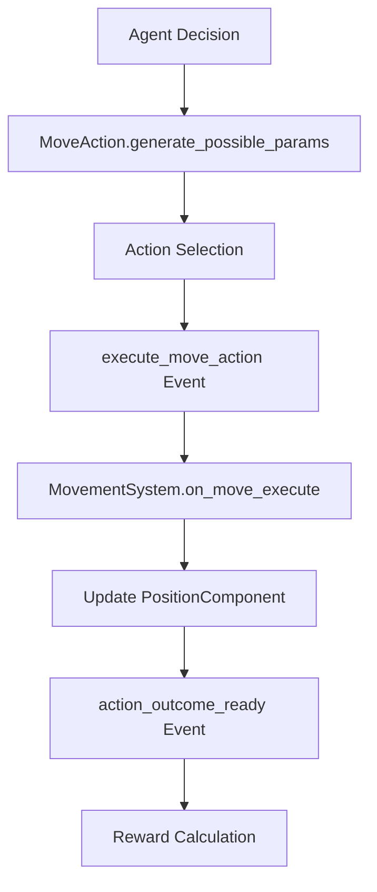

# Building Your First Simulation

Learn ARLA fundamentals by creating a simple yet complete simulation from scratch. You'll build agents that move in a 2D world while mastering the core concepts of Components, Actions, and Systems.

!!! info "What You'll Learn"
    - **Entity-Component-System (ECS)** architecture patterns
    - **Component design** for pure data storage
    - **Action implementation** for agent behaviors
    - **System development** for world logic
    - **Event-driven communication** between systems

## Overview: The Simple Movement Simulation

We'll create a basic simulation where agents move randomly in a 2D grid world. This covers all essential ARLA concepts in a digestible example.

<div class="grid cards" markdown>

-   **🗂️ Components**
    
    Store agent position data

-   **⚡ Actions**
    
    Define movement possibilities

-   **⚙️ Systems**
    
    Handle movement logic

-   **📡 Events**
    
    Coordinate between systems

</div>

---

## Step 1: Create Project Structure

Set up the directory structure for your new simulation:

```bash
mkdir -p simulations/simple_sim/actions
mkdir -p simulations/simple_sim/config
```

Your structure should look like:

```
simulations/
└── simple_sim/
    ├── actions/
    └── config/
```

---

## Step 2: Define a Position Component

Components are pure data containers with no logic. Create your first component to track agent positions.

=== "components.py"

    ```python title="simulations/simple_sim/components.py"
    from agent_core.core.ecs.component import Component
    from typing import Tuple, Dict, Any

    class PositionComponent(Component):
        """Stores an entity's x, y coordinates in the grid world."""
        
        def __init__(self, x: int = 0, y: int = 0):
            self.x = x
            self.y = y
            self.previous_x = x
            self.previous_y = y
        
        def move_to(self, new_x: int, new_y: int) -> None:
            """Update position and track previous location."""
            self.previous_x, self.previous_y = self.x, self.y
            self.x, self.y = new_x, new_y
        
        @property
        def position(self) -> Tuple[int, int]:
            """Current position as tuple."""
            return (self.x, self.y)
        
        @property
        def previous_position(self) -> Tuple[int, int]:
            """Previous position as tuple."""
            return (self.previous_x, self.previous_y)
        
        def to_dict(self) -> Dict[str, Any]:
            """Serialize component for persistence."""
            return {
                "x": self.x,
                "y": self.y,
                "previous_x": self.previous_x,
                "previous_y": self.previous_y
            }
        
        def validate(self, entity_id: str) -> Tuple[bool, List[str]]:
            """Validate component state."""
            errors = []
            
            if not isinstance(self.x, int) or not isinstance(self.y, int):
                errors.append("Position coordinates must be integers")
            
            return len(errors) == 0, errors
    ```

=== "Key Features"

    - **Pure Data**: No business logic, only state storage
    - **Validation**: Built-in error checking for data integrity  
    - **Serialization**: `to_dict()` enables saving/loading state
    - **Convenience Methods**: Helper properties for cleaner code

---

## Step 3: Create a Movement Action

Actions define what agents can do. They generate possible parameters and delegate execution to Systems via events.

=== "move_action.py"

    ```python title="simulations/simple_sim/actions/move_action.py"
    from typing import Any, Dict, List
    from agent_core.agents.actions.action_interface import ActionInterface
    from agent_core.agents.actions.action_registry import action_registry
    from agent_core.agents.actions.base_action import ActionOutcome
    from agent_core.core.ecs.abstractions import SimulationState
    from ..components import PositionComponent

    @action_registry.register
    class MoveAction(ActionInterface):
        """Allows an agent to move to an adjacent grid cell."""
        
        @property
        def action_id(self) -> str:
            return "move"
        
        @property
        def name(self) -> str:
            return "Move"
        
        def get_base_cost(self, simulation_state: SimulationState) -> float:
            """Energy cost for movement."""
            return 1.0
        
        def generate_possible_params(
            self, 
            entity_id: str, 
            simulation_state: SimulationState, 
            current_tick: int
        ) -> List[Dict[str, Any]]:
            """Generate all valid movement options."""
            
            pos_comp = simulation_state.get_component(entity_id, PositionComponent)
            if not pos_comp:
                return []
            
            # Define possible movement directions
            directions = [
                {"dx": 0, "dy": 1, "direction": "north"},
                {"dx": 1, "dy": 0, "direction": "east"}, 
                {"dx": 0, "dy": -1, "direction": "south"},
                {"dx": -1, "dy": 0, "direction": "west"}
            ]
            
            valid_moves = []
            for direction in directions:
                new_x = pos_comp.x + direction["dx"]
                new_y = pos_comp.y + direction["dy"]
                
                # Simple bounds checking (extend as needed)
                if 0 <= new_x < 50 and 0 <= new_y < 50:
                    valid_moves.append({
                        "dx": direction["dx"],
                        "dy": direction["dy"],
                        "target_x": new_x,
                        "target_y": new_y,
                        "direction": direction["direction"]
                    })
            
            return valid_moves
        
        def execute(
            self,
            entity_id: str,
            simulation_state: SimulationState,
            params: Dict[str, Any],
            current_tick: int,
        ) -> ActionOutcome:
            """Return action outcome. Actual logic handled by MovementSystem."""
            direction = params.get("direction", "unknown")
            target = (params.get("target_x"), params.get("target_y"))
            
            return ActionOutcome(
                success=True,
                message=f"Agent {entity_id} moves {direction} to {target}",
                base_reward=0.1
            )
        
        def get_feature_vector(
            self,
            entity_id: str,
            simulation_state: SimulationState,
            params: Dict[str, Any],
        ) -> List[float]:
            """Encode action for machine learning."""
            # Simple encoding: [is_move_action, dx, dy]
            return [
                1.0,  # Move action identifier
                float(params.get("dx", 0)),
                float(params.get("dy", 0))
            ]
    ```

=== "Key Features"

    - **@action_registry.register**: Auto-discovery by the simulation engine
    - **Parameter Generation**: Creates all valid movement options
    - **Bounds Checking**: Prevents agents from moving off the grid
    - **ML Integration**: Feature vectors for learning algorithms

---

## Step 4: Implement Movement System

Systems contain the business logic. They subscribe to events and update the simulation state.

=== "systems.py"

    ```python title="simulations/simple_sim/systems.py"
    from typing import Any, Dict
    from agent_engine.simulation.system import System
    from .components import PositionComponent

    class MovementSystem(System):
        """Handles agent movement in the grid world."""
        
        def __init__(self, simulation_state, config, cognitive_scaffold):
            super().__init__(simulation_state, config, cognitive_scaffold)
            
            # Subscribe to movement action events
            if self.event_bus:
                self.event_bus.subscribe("execute_move_action", self.on_move_execute)
        
        def on_move_execute(self, event_data: Dict[str, Any]) -> None:
            """Process movement action execution."""
            entity_id = event_data["entity_id"]
            action_plan = event_data["action_plan_component"]
            params = action_plan.params
            
            # Get agent's position component
            pos_comp = self.simulation_state.get_component(entity_id, PositionComponent)
            if not pos_comp:
                self._publish_failure(event_data, "Agent has no position component")
                return
            
            # Extract movement parameters
            target_x = params.get("target_x")
            target_y = params.get("target_y")
            
            if target_x is None or target_y is None:
                self._publish_failure(event_data, "Invalid movement parameters")
                return
            
            # Validate movement is within bounds
            if not self._is_valid_position(target_x, target_y):
                self._publish_failure(event_data, f"Position ({target_x}, {target_y}) out of bounds")
                return
            
            # Update position
            old_pos = pos_comp.position
            pos_comp.move_to(target_x, target_y)
            
            print(f"🚶 Agent {entity_id} moved from {old_pos} to {pos_comp.position}")
            
            # Signal action completion
            self._publish_success(event_data)
        
        def _is_valid_position(self, x: int, y: int) -> bool:
            """Check if position is within world bounds."""
            return 0 <= x < 50 and 0 <= y < 50
        
        def _publish_success(self, event_data: Dict[str, Any]) -> None:
            """Notify that action completed successfully."""
            if self.event_bus:
                self.event_bus.publish("action_outcome_ready", event_data)
        
        def _publish_failure(self, event_data: Dict[str, Any], reason: str) -> None:
            """Notify that action failed."""
            print(f"❌ Movement failed: {reason}")
            # Update action outcome to reflect failure
            if hasattr(event_data.get("action_plan_component"), "outcome"):
                event_data["action_plan_component"].outcome.success = False
                event_data["action_plan_component"].outcome.message = reason
            
            if self.event_bus:
                self.event_bus.publish("action_outcome_ready", event_data)
        
        async def update(self, current_tick: int) -> None:
            """Main system update loop. Movement is event-driven, so nothing needed here."""
            pass
    ```

=== "Key Features"

    - **Event Subscription**: Listens for `execute_move_action` events
    - **State Validation**: Checks components exist and parameters are valid
    - **Bounds Checking**: Prevents invalid movements
    - **Error Handling**: Graceful failure with informative messages
    - **Event Publishing**: Signals action completion to other systems

---

## Step 5: Create Simulation Entry Point

Tie everything together with a main runner that registers your systems and starts the simulation.

=== "run.py"

    ```python title="simulations/simple_sim/run.py"
    import asyncio
    from pathlib import Path
    from typing import Optional
    from omegaconf import OmegaConf
    
    from agent_engine.simulation.engine import SimulationManager
    from .systems import MovementSystem
    from .components import PositionComponent

    async def setup_and_run(
        run_id: str,
        task_id: str, 
        experiment_id: str,
        config_overrides: dict,
        checkpoint_path: Optional[str] = None
    ):
        """Initialize and run the simple movement simulation."""
        
        print(f"🚀 Starting Simple Simulation - Run: {run_id}")
        
        # Load base configuration
        config_path = Path(__file__).parent / "config" / "base_config.yml"
        if config_path.exists():
            base_config = OmegaConf.load(config_path)
            final_config = OmegaConf.merge(base_config, config_overrides)
        else:
            final_config = OmegaConf.create(config_overrides)
        
        # Create simulation manager with required dependencies
        # Note: In a real implementation, you'd inject proper dependencies
        manager = SimulationManager(
            config=final_config,
            run_id=run_id,
            task_id=task_id,
            experiment_id=experiment_id,
            checkpoint_path=checkpoint_path
        )
        
        # Register custom systems
        manager.register_system(MovementSystem)
        
        # Add startup entities (agents with position components)
        await _initialize_agents(manager, final_config)
        
        print(f"🎯 Simulation configured with {final_config.get('agent_count', 10)} agents")
        
        # Run the simulation
        await manager.run()
        
        print(f"✅ Simulation {run_id} completed")

    async def _initialize_agents(manager: SimulationManager, config: dict):
        """Create initial agents with position components."""
        agent_count = config.get("agent_count", 10)
        
        for i in range(agent_count):
            entity_id = f"agent_{i:03d}"
            
            # Create agent at random position
            import random
            x = random.randint(0, 49)
            y = random.randint(0, 49)
            
            # Add position component
            position_comp = PositionComponent(x=x, y=y)
            manager.simulation_state.add_component(entity_id, position_comp)
            
            print(f"🤖 Created {entity_id} at position ({x}, {y})")

    def start_simulation(run_id: str, task_id: str, experiment_id: str, config_overrides: dict):
        """Entry point for external callers."""
        asyncio.run(setup_and_run(run_id, task_id, experiment_id, config_overrides))
    ```

=== "Configuration"

    ```yaml title="simulations/simple_sim/config/base_config.yml"
    # Basic configuration for simple movement simulation
    
    simulation:
      max_ticks: 1000
      random_seed: 42
    
    world:
      grid_size: 50
      
    agents:
      count: 10
      start_energy: 100.0
    
    logging:
      level: "INFO"
      log_movements: true
    ```

---

## Step 6: Test Your Simulation

Now run your simulation and see agents moving around the grid world:

```bash
cd simulations/simple_sim
python -c "
from run import start_simulation
start_simulation('test_run_001', 'tutorial_task', 'simple_sim_experiment', {
    'agent_count': 5,
    'simulation': {'max_ticks': 100}
})
"
```

**Expected Output:**
```
🚀 Starting Simple Simulation - Run: test_run_001
🤖 Created agent_000 at position (23, 15)
🤖 Created agent_001 at position (8, 42)
🤖 Created agent_002 at position (35, 7)
🚶 Agent agent_000 moved from (23, 15) to (24, 15)
🚶 Agent agent_001 moved from (8, 42) to (8, 43)
...
✅ Simulation test_run_001 completed
```

---

## Understanding the Architecture

### Event Flow Diagram



### Key Concepts Learned

!!! success "ECS Architecture"
    - **Entities**: Unique IDs for agents
    - **Components**: Pure data (PositionComponent)
    - **Systems**: Logic (MovementSystem)

!!! success "Event-Driven Design"
    - Systems communicate via events, not direct calls
    - Loose coupling enables easy testing and modification
    - Clear separation of concerns

!!! success "Action Pattern"
    - Actions define possibilities, not implementation
    - Parameters generated dynamically based on world state
    - Systems handle the actual world changes

---

## Next Steps

Congratulations! You've built a complete ARLA simulation. Here's how to expand it:

<div class="grid cards" markdown>

-   **🎯 Add More Actions**

    ---

    Create actions for resource gathering, agent communication, or combat interactions.

    [:octicons-arrow-right-24: Creating Actions Guide](../developer/creating-actions.md)

-   **🧠 Add Cognitive Systems**

    ---

    Integrate memory, goals, and decision-making systems from the agent-engine.

    [:octicons-arrow-right-24: Cognitive Architecture](../api/agent-engine.md)

-   **🌍 Expand the World**

    ---

    Add terrain, resources, obstacles, and environmental dynamics.

    [:octicons-arrow-right-24: Advanced Systems](../developer/creating-systems.md)

-   **📊 Run Experiments**

    ---

    Design experiments with multiple configurations and analyze results.

    [:octicons-arrow-right-24: Running Experiments](../guides/running-simulations.md)

</div>